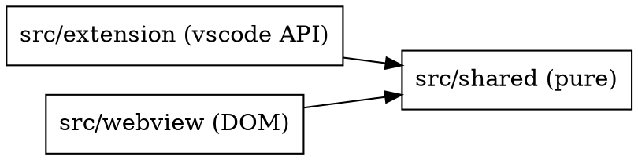

# Lectern — Architecture

<!-- TRIM-BANNER:start (the skill removes this block for a structured service; keeps it for a small project) -->
> **Trim for small projects.** This document is the full default for a structured service.
> For a small or single-file project, keep the Onion layering table and the dependency rule as
> a mental model, delete the supporting-patterns and principles sections you are not using, and
> revisit them only when the project grows. Do not carry dead scaffolding — prune in place.
<!-- TRIM-BANNER:end -->

Lectern is small: one extension, one webview. This is the trimmed architecture note. If it
ever grows into something with real layers, adopt the full Onion reference from the
`jumpstart-project` skill (`reference/architecture.md`).

## Dependency direction

| Zone | Owns | Must NOT contain |
|------|------|------------------|
| `src/shared/` | Pure, unit-tested logic and the message contract (`messages.ts`). | Any import of `vscode`, any DOM access, any input/output. |
| `src/extension/` | `ReaderProvider` (custom text editor), commands, link routing, `globalState` persistence. | Rendering logic. HTML is a static shell; content is rendered in the webview. |
| `src/webview/` | markdown-it renderer and plugins, diagram loading, contents rail, scroll anchoring, styles. | Any file system or VS Code API access beyond `acquireVsCodeApi().postMessage`. |

## Where logic lives

- Anything that can be a pure function goes in `src/shared/` or a pure module under
  `src/webview/render/` and gets a vitest test first.
- The extension host stays thin: it forwards document text, routes links, and persists
  the contents width and visibility.
- The webview owns every pixel. Theme colors come only from `--vscode-*` variables.
- The extension and the webview communicate only through the discriminated-union message
  types in `src/shared/messages.ts`. Unknown message types are ignored with a warning.

## Security boundary

The webview runs under a nonce-based Content Security Policy (`script-src 'nonce-…'
'wasm-unsafe-eval'`). Raw HTML in a markdown document can render but can't execute
script. Never loosen the policy to `'unsafe-eval'` or `'unsafe-inline'` for scripts.
