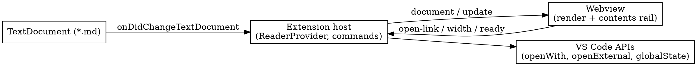

# Lectern — Design

A VS Code extension that makes markdown pleasant to *read* on Ross's Windows PC: a
read-only reader tab that takes qv's markdown view as its model and fixes the three
things qv gets wrong.

Status: approved 2026-09-28. Repository: `rosschambers/lectern` (public), registered at
`code/projects/lectern`. The look was settled in an interactive HTML playground; the table
below is the authoritative record of every choice.

## Goals and non-goals

**Goals**

- Double-clicking a `.md` file in stock VS Code on Windows opens a rendered reader tab.
- The look comes from the playground session (see "Settled look" below).
- Renders what Ross's docs actually contain: YAML frontmatter, `<HARD-GATE>`-style tags,
  `dot` digraphs, mermaid, task lists, tables, and code.
- Installs from a GitHub release `.vsix` on the public repo.

**Non-goals (YAGNI)**

- Editing inside the reader. Source editing stays in VS Code's text editor.
- Scroll sync with the source editor.
- JSON, code, image, or video previews. VS Code already handles those.
- Marketplace publishing, Cursor/Open VSX, and settings beyond the contents-list width.
- Sharing code with quantum. qv is a *reference*: we read it, we do not import or copy it.

## Settled look (from the playground)

| Concern | Decision |
|---|---|
| Opening | Lectern is the **default editor for `*.md`**. A pencil title-bar button ("Edit source") reopens the file in the text editor in the same tab. "Open source to the side" lives in the `...` menu. Markdown text editors get an "Open in Lectern" title-bar button. |
| Palette | **Follows the active VS Code theme** through `--vscode-*` webview variables. Accent comes from `--vscode-textLink-foreground`. Body text is full contrast. |
| Header | **None.** The tab shows the filename; actions sit in the VS Code title bar. |
| Contents list | **Left**, minimal rail with an accent tick on the active entry, **H1 to H6**, scroll-spy, click-to-scroll, Ctrl+Up/Down jumps between headings. **190px by default, drag-resizable in VS Code**; the width is remembered globally, and double-clicking the handle resets it. A title-bar button and a command toggle the rail. |
| Text column | Full width, 20px side padding. |
| Typography | `--vscode-font-family` (Segoe UI on Windows) at 13px, line-height 1.5. Code uses `--vscode-editor-font-family` (Cascadia Code / Consolas). |
| Frontmatter | Rendered as a **highlighted raw YAML code block**. |
| Gate tags | `<HARD-GATE>`, `<EXTREMELY-IMPORTANT>`, and any line-alone `<UPPER-KEBAB>` tag become **warning callouts** with a label, and the markdown inside them is parsed. |
| Diagrams | `dot`/`graphviz`/`digraph` and `mermaid` fences render as SVG **recolored to the theme**. Graphviz loses its white background polygon, default black strokes and text map to theme colors, and colors set explicitly in the source are kept. |
| Other | Read-only task checkboxes with completed items struck through, bordered code blocks, H1 underline, zebra table rows, and hover `#` anchors on headings. |

## Architecture

We picked a `CustomTextEditorProvider` over the other two options:

- **Extending the built-in preview** gives a fixed page layout (the contents rail would be a DOM hack), changes every preview globally, and can't be the default double-click view.
- **A standalone webview panel** isn't a real editor type, so it can't appear in "Reopen With" or be the default.

The custom text editor uses VS Code's own `TextDocument`, so it updates live while the
source is being edited in a split, and it reads unsaved text.

**Stack:** TypeScript (strict) and esbuild with two bundles: extension (CommonJS, Node)
and webview (ESM, browser, code-split so diagram libraries load lazily). No UI framework,
because the webview is one document plus one rail. Libraries: `markdown-it` 14,
`highlight.js` 11, `mermaid` 12, `@hpcc-js/wasm-graphviz` 1, `vitest` 5 + `jsdom`,
`@vscode/test-electron` 3, `@vscode/vsce` 4, TypeScript 7 (type-check only; esbuild emits).
Versions were verified against npm on 2026-09-28. (markdown-it is on 15 now, not 14; it
ships its own types.) We use markdown-it rather than qv's `marked`
because its token stream carries line maps and headings (the outline comes from tokens,
not a regex), and because it's the VS Code ecosystem parser.

## Components and acceptance criteria

### 1. Manifest and activation (`package.json`)

- A `customEditors` entry with `viewType: "lectern.reader"`, selector `*.md` and `*.markdown`, and `priority: "default"`.
- Commands: `lectern.editSource`, `lectern.editSourceToSide`, `lectern.openInLectern`, `lectern.toggleContents`, `lectern.resetContentsWidth`.
- The pencil button shows only when `activeCustomEditorId == lectern.reader`. "Open in Lectern" shows only when `resourceLangId == markdown` in a text editor.
- Setting `lectern.contents.defaultWidth` (number, default 190, min 120, max 480). This is the only setting.
- `engines.vscode` is `^1.90.0`.

### 2. ReaderProvider (extension host)

- `resolveCustomTextEditor` sets HTML with a per-load nonce Content Security Policy: `default-src 'none'`; `script-src 'nonce-X' 'strict-dynamic' 'wasm-unsafe-eval'`; `style-src ${cspSource} 'unsafe-inline'`; `img-src ${cspSource} https: data:`; `font-src ${cspSource}`. `'strict-dynamic'` lets the nonce-trusted entry module `import()` its lazy diagram chunks without allowlisting every extension resource as a script source (the workspace is also a resource root, and a markdown file must never be able to load a workspace `.js` as script). The v0.0.1 spike proves this. The fallback is adding `${cspSource}` to `script-src`.
- `localResourceRoots` = the extension `dist/` + every workspace folder + the document's own folder (for files opened outside a workspace).
- After the webview posts `ready`, the provider posts `{type: "document", text, baseUri, contents: {width, visible}}`, where `baseUri` is the document folder as a webview URI.
- Document changes are debounced to 150ms and posted as `{type: "update", text}`. Changes to other documents are ignored.
- Subscriptions are disposed on `onDidDispose`. No leak across open/close cycles.

### 3. Link and command routing (extension host)

- A `#fragment` link scrolls inside the webview and never reaches the extension.
- A relative or absolute `.md` link (with an optional `#fragment`) opens in Lectern through `vscode.openWith(uri, "lectern.reader")` and scrolls to the fragment.
- Any other relative file opens with `vscode.open`. `http(s):` and `mailto:` go to `vscode.env.openExternal`. Every other scheme is dropped.
- Windows paths (drive letters, backslashes, `%20`) resolve correctly. This is covered by unit tests on the pure `classifyLink` / `resolveLinkTarget` functions.
- `editSource` runs `vscode.openWith(uri, "default")` in the same view column. `editSourceToSide` does the same beside it. `openInLectern` is the inverse.

### 4. Renderer (webview, pure and unit-tested)

- `createRenderer()` returns a markdown-it instance with `html: true` and `linkify: true`, plus our plugins:
  - **frontmatter:** a leading `---\n...\n---` block becomes a YAML-highlighted `<pre>`. It never becomes an `
` or a setext heading.
  - **gates:** a line containing only `<TAG>` (uppercase, digits, hyphens) through a line containing only `</TAG>` becomes `

TAG with spaces
…parsed markdown…
`. An unclosed tag renders as a plain paragraph with no crash.
  - **headings:** each heading gets a unique slug id (duplicates get `-1`, `-2`) and a hover anchor.
  - **tasks:** `- [ ]` and `- [x]` become disabled checkboxes, with `.done` on checked items.
  - **fences:** mermaid and dot/graphviz/digraph fences emit escaped diagram placeholders; everything else is highlighted by highlight.js with the language auto-detected when none is given.
- `buildOutline(tokens)` returns `{level, text, id}` for H1 to H6 from the token stream. `#` lines inside code fences are never included. CRLF input gives the same outline as LF.
- A render failure shows an error panel with the message and the escaped source. The webview never goes blank.

### 5. Diagrams (webview)

- Mermaid and Graphviz load only when a placeholder exists. A document without diagrams never fetches either chunk.
- Graphviz recoloring is **pure CSS**, with no SVG string rewriting. CSS rules override SVG presentation attributes, so attribute selectors (`[stroke="black"]`, `[fill="black"]`, `text:not([fill])`, and the root `g.graph > polygon[fill="white"]:first-of-type` background) map Graphviz's defaults to theme variables. Colors set explicitly in the source (`color=red` becomes `stroke="red"`) are never matched, so they survive untouched. A contract test runs the real Graphviz WebAssembly in Node and asserts the output still carries the attributes those selectors target, so a Graphviz upgrade that changes its output fails loudly.
- Mermaid runs with `securityLevel: "strict"` and theme `base`, with variables read from the computed `--vscode-*` values.
- A body-class change (`vscode-dark`, `vscode-light`, `vscode-high-contrast`) re-renders mermaid so a theme switch never leaves stale colors.
- Diagrams fail one at a time: an error line plus highlighted source. A chunk-load failure marks every pending diagram of that type.

### 6. Contents rail (webview)

- The rail lists every outline entry H1 to H6, indented 12px per level. It's hidden when the outline has fewer than 2 entries.
- Scroll-spy highlights the last heading above the top 40px of the viewport. Clicking an entry scrolls to it. Ctrl+Up/Down jumps to the previous or next heading.
- A drag handle resizes the rail between 120px and 480px. On mouse-up the width is posted and stored in `globalState`, so all reader tabs share it. Double-click resets to `lectern.contents.defaultWidth`.
- The visibility toggle persists in `globalState`.
- Re-rendering after an update keeps the reading position (anchored to the nearest heading plus offset). It never jumps to the top.

### 7. Styles (webview)

- All colors come from `--vscode-*` variables. There are no hardcoded hex values except inside `var()` fallbacks.
- The palette is legible in Dark Modern, Light Modern, and High Contrast. This is checked by screenshots from the harness (see Testing).

### 8. Packaging and release

- `pnpm run package` produces `lectern-<version>.vsix` with no dev dependencies and no source maps. Its size is reported.
- A GitHub Actions workflow runs on `v*` tags: install, test, package, then attach the `.vsix` to a GitHub release.
- Windows install instructions in the README: download the `.vsix` from the latest release page (or `gh release download --repo rosschambers/lectern --pattern "*.vsix"`), then `code --install-extension lectern-<version>.vsix`.
- The repo is public. Nothing personal goes in fixtures: sample documents are synthetic or already-public text, never copied from the exocortex brain.

## Error handling summary

| Failure | Behavior |
|---|---|
| markdown-it throws | Error panel with the message plus escaped raw text |
| One diagram fails | That diagram shows an error line and highlighted source; the rest render |
| A diagram library fails to load | Every pending diagram of that type is marked with the load error |
| Link target missing | VS Code's own "file not found" from `openWith`; no crash |
| Webview message of an unknown type | Ignored with a `console.warn` |

## Testing

- **Unit tests (vitest):** renderer plugins, outline, slug, `recolorGraphvizSvg`, `classifyLink`, `resolveLinkTarget` (including Windows paths), and scroll anchoring. Each test starts red.
- **Integration (`@vscode/test-electron`, runs on Linux here):**
  - Opening a fixture `.md` makes `lectern.reader` the active custom editor.
  - `editSource` switches the tab to the text editor, and `openInLectern` switches it back.
  - The contents commands run without error. Live update while editing isn't observable from the extension test API, so it's covered by the Windows checklist (source to the side, type, and the reader updates).
- **Visual harness:** `harness/index.html` loads the *real* webview bundle with a stub `acquireVsCodeApi` and Dark Modern, Light Modern, and High Contrast variable sets. Playwright screenshots the fixture document in each theme, so the look is proven on the real bundle before Ross installs anything.
- **Real-artifact check on the Windows PC (Ross):** install the released `.vsix` and run through `docs/windows-checklist.md`:
  - double-click opens Lectern
  - the pencil opens the source
  - a CRLF fixture renders the same as the LF one
  - relative images and `.md` links work
  - dot and mermaid render in Dark and Light
  - the rail resize persists across a VS Code restart

## Assumptions

- Stock VS Code 1.90 or newer on Windows 10/11. The build host is x1 (Node 24, pnpm). The Windows PC can download public GitHub releases.
- The VS Code webview Content Security Policy accepts `'wasm-unsafe-eval'`, and mermaid 11 runs without `unsafe-eval`. **Unproven:** the first spike tests this.
- `priority: "default"` custom editors behave acceptably in SCM diff views, quick-open, and markdown link navigation. **Unproven:** the first spike tests this, with a fallback of `priority: "option"` plus a documented `workbench.editorAssociations` entry.

## De-risk first (plan Task 1)

Before any real features, ship **v0.0.1**: a custom editor that renders one mermaid and
one dot fence under the real Content Security Policy, released as a `.vsix` through the
real GitHub Actions path and installed on the Windows PC. That one slice proves the three
unproven links (webview CSP for WASM and mermaid, default-editor behavior, and the Windows
install path) before anything is built on top of them.

## Side findings for qv (out of scope, noted for quantum)

- qv's contents regex (`^(#{1,6})\s+`) picks up `#` comment lines inside code fences.
- qv renders YAML frontmatter as an `
` plus a setext H2.
- qv flattens `<HARD-GATE>` blocks into a run-on paragraph.
