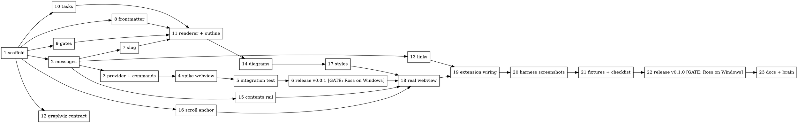
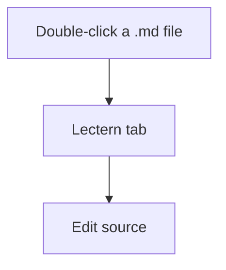
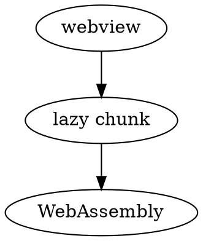
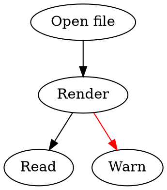
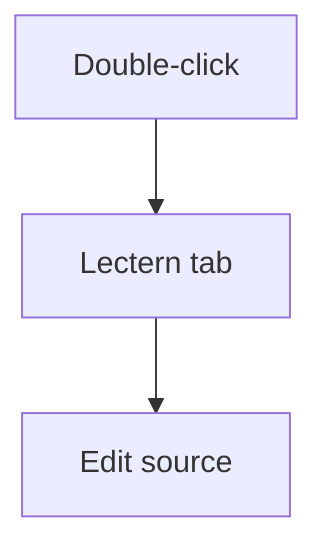

# Lectern Implementation Plan

> **For OpenCode:** REQUIRED SUB-SKILL: Use superpowers:executing-plans to implement this plan task-by-task.

**Goal:** Build Lectern, a VS Code custom text editor that opens `*.md` as a read-only reader tab (contents rail, themed diagrams, frontmatter, gate callouts). Ship it as a `.vsix` from GitHub releases for stock VS Code on Windows.

**Architecture:** A thin extension host (`src/extension/`) registers a `CustomTextEditorProvider`, routes links, and persists the contents-rail state. The webview (`src/webview/`) owns all rendering: markdown-it with our plugins, lazily loaded mermaid and Graphviz WebAssembly, the contents rail, and scroll anchoring. `src/shared/` holds the pure logic and the typed message contract both sides use. Design: `docs/plans/2026-09-28-lectern-design.md`.

**Tech Stack:** TypeScript 7 (type-check only), esbuild 0.28 (two bundles), markdown-it 15 (ships its own types), highlight.js 11 (`lib/common`), mermaid 12, `@hpcc-js/wasm-graphviz` 1, vitest 5 + jsdom, `@vscode/test-electron` 3, `@vscode/vsce` 4, pnpm 11, GitHub Actions.

**Assumptions (verified on x1, 2026-09-28, unless marked):**
- Node 24.19, pnpm 11.25, and VS Code 1.135 are at `$(command -v code)`. Library majors match the npm registry on that date.
- markdown-it 15's default export is callable (`markdownIt({...})`). It exports the types `MarkdownIt`, `Token`, `StateBlock`, and `StateCore`, and it normalizes CRLF to LF before tokenizing.
- Task-list items reach the core chain as one `text` child (`"[ ] a"`) after `text_join`.
- Graphviz SVG output:
  - The root group is `<g id="graph0" class="graph">`, with a background `<polygon fill="white" stroke="none">`.
  - Default strokes are `stroke="black"` and arrowheads are `fill="black"`.
  - Text elements carry no `fill`.
  - An explicit `color=red` in the source becomes `stroke="red"`.
- WHATWG `URL` resolves backslash-relative hrefs against a `file:///c%3A/...` base, keeping `c%3A`. A bare `C:/x.md` href parses as scheme `c:`, so drive paths must be detected before scheme detection.
- `@types/vscode` is pinned to `1.90.0` to match `engines.vscode: ^1.90.0`. The latest types (1.138) would allow APIs that older engines lack.
- **Unproven, and settled by the Task 6 gate:**
  - The webview CSP `'nonce' 'strict-dynamic' 'wasm-unsafe-eval'` allows lazy `import()` chunks and Graphviz WebAssembly.
  - `priority: "default"` behaves acceptably in Source Control diff views.
  - The `.vsix` installs cleanly on the Windows PC.
- No `xvfb-run` exists on x1. A local integration run opens a real VS Code window on Ross's screen for a few seconds, while CI runs headless under `xvfb-run`.

**Conventions for every task:**
- Run every command with `workdir` = `code/projects/lectern` (relative to the exocortex root). Never `cd`.
- Test-driven: write the failing test, watch it fail for the stated reason, implement, watch it pass.
- No abbreviations in identifiers, comments, or commit messages (see `docs/CODE-STANDARDS.md`). Use the `function` keyword for declarations and explicit return types on exported functions. No nested ternaries.
- Commit per task, staging by explicit path, with conventional commit messages.
- This repo is public. Fixtures are synthetic. Never copy documents out of the exocortex brain.

## Task order and parallelism



Tasks 7–16 are pure modules, and each owns only the files it lists. They can run as parallel subagents while Ross does the Task 6 Windows check. Task 18 must not start until the Task 6 gate result is recorded, because it may change the CSP or the editor priority.

---

## Phase A — scaffold and the v0.0.1 de-risk slice

### Task 1: Toolchain scaffold

**Files:**
- Create: `package.json`, `tsconfig.json`, `tsconfig.webview.json`, `vitest.config.ts`, `esbuild.mjs`, `.vscodeignore`, `LICENSE`, `README.md`, `src/extension/extension.ts`, `src/webview/main.ts`
- Modify: `.gitignore`

**Acceptance Criteria:**
1. `pnpm install` succeeds, and `pnpm exec esbuild --version` prints `0.28.x`.
2. `pnpm run typecheck` exits 0.
3. `pnpm run build` creates `dist/extension.js` and `dist/webview/main.js`.
4. `pnpm test` exits 0 (vitest runs with no test files: `passWithNoTests`).
5. `package.json` has `engines.vscode` `^1.90.0`, `publisher` `rosschambers`, `license` `MIT`, `main` `./dist/extension.js`, and `packageManager` `pnpm@11.25.0`.
6. `.gitignore` ignores `node_modules/`, `dist/`, `dist-test/`, `dist-harness/`, `.vscode-test/`, `*.vsix`.

**Step 1: Write `package.json`**

```json
{
  "name": "lectern",
  "displayName": "Lectern",
  "description": "A read-only markdown reader tab: contents rail, themed Graphviz and mermaid diagrams, frontmatter and gate-tag rendering.",
  "version": "0.0.1",
  "publisher": "rosschambers",
  "license": "MIT",
  "repository": { "type": "git", "url": "https://github.com/rosschambers/lectern" },
  "engines": { "vscode": "^1.90.0" },
  "categories": ["Visualization", "Other"],
  "main": "./dist/extension.js",
  "packageManager": "pnpm@11.25.0",
  "scripts": {
    "build": "node esbuild.mjs",
    "typecheck": "tsc --noEmit -p tsconfig.json && tsc --noEmit -p tsconfig.webview.json",
    "test": "vitest run",
    "test:integration": "node esbuild.mjs --integration && node dist-test/run.js",
    "package": "node esbuild.mjs --production && vsce package --no-dependencies",
    "harness": "node esbuild.mjs --harness --serve"
  },
  "contributes": {}
}
```

**Step 2: Install dependencies**

```bash
pnpm add markdown-it@^15 highlight.js@^11 mermaid@^12 @hpcc-js/wasm-graphviz@^1
pnpm add -D typescript@^7 esbuild@^0.28 vitest@^5 jsdom@^30 @types/vscode@1.90.0 @types/node@^24 @vscode/test-electron@^3 @vscode/vsce@^4
```

If pnpm reports ignored build scripts for `esbuild`, run `pnpm approve-builds`, approve `esbuild`, and include the file it writes in the commit. Verify with `pnpm exec esbuild --version`.

**Step 3: Write the TypeScript configs**

`tsconfig.json` (extension host, shared, integration tests):

```json
{
  "compilerOptions": {
    "target": "ES2022",
    "module": "preserve",
    "moduleResolution": "bundler",
    "strict": true,
    "noEmit": true,
    "skipLibCheck": true,
    "lib": ["ES2022"],
    "types": ["node", "vscode"]
  },
  "include": ["src/extension", "src/shared", "test/integration"]
}
```

`tsconfig.webview.json` (webview, shared, harness):

```json
{
  "extends": "./tsconfig.json",
  "compilerOptions": { "lib": ["ES2022", "DOM", "DOM.Iterable"], "types": [] },
  "include": ["src/webview", "src/shared", "harness"]
}
```

**Step 4: Write `vitest.config.ts`**

```ts
import { defineConfig } from 'vitest/config';

export default defineConfig({
  test: {
    include: ['src/**/*.test.ts'],
    environment: 'node',
    passWithNoTests: true,
  },
});
```

DOM tests opt in per file with a first-line `// @vitest-environment jsdom` comment.

**Step 5: Write `esbuild.mjs`**

```js
import * as esbuild from 'esbuild';
import { cpSync, rmSync } from 'node:fs';

const commandLine = process.argv.slice(2);
const production = commandLine.includes('--production');

/* ---------- bundle definitions ---------- */
const extensionBuild = {
  entryPoints: ['src/extension/extension.ts'],
  bundle: true,
  format: 'cjs',
  platform: 'node',
  target: 'node20',
  outfile: 'dist/extension.js',
  external: ['vscode'],
  sourcemap: !production,
  minify: production,
  logLevel: 'info',
};

const webviewBuild = {
  entryPoints: { main: 'src/webview/main.ts' },
  bundle: true,
  format: 'esm',
  splitting: true,
  platform: 'browser',
  target: 'chrome120',
  outdir: 'dist/webview',
  sourcemap: !production,
  minify: production,
  logLevel: 'info',
};

const integrationBuild = {
  entryPoints: ['test/integration/run.ts', 'test/integration/suite.ts'],
  bundle: true,
  format: 'cjs',
  platform: 'node',
  target: 'node20',
  outdir: 'dist-test',
  external: ['vscode', '@vscode/test-electron'],
  logLevel: 'info',
};

const harnessBuild = {
  entryPoints: { harness: 'harness/harness.ts' },
  bundle: true,
  format: 'esm',
  splitting: true,
  platform: 'browser',
  target: 'chrome120',
  outdir: 'dist-harness',
  loader: { '.md': 'text' },
  sourcemap: true,
  logLevel: 'info',
};

/* ---------- modes ---------- */
async function buildHarness() {
  rmSync('dist-harness', { recursive: true, force: true });
  cpSync('harness/index.html', 'dist-harness/index.html');
  cpSync('test/fixtures/images', 'dist-harness/fixtures/images', { recursive: true });
  const context = await esbuild.context(harnessBuild);
  if (commandLine.includes('--serve')) {
    const { port } = await context.serve({ servedir: 'dist-harness', port: 8766 });
    console.log(`harness: http://127.0.0.1:${port}/?theme=dark (also light, high-contrast)`);
    await context.watch();
    return;
  }
  await context.rebuild();
  await context.dispose();
}

async function main() {
  if (commandLine.includes('--harness')) {
    await buildHarness();
    return;
  }
  rmSync('dist', { recursive: true, force: true });
  await esbuild.build(extensionBuild);
  await esbuild.build(webviewBuild);
  if (commandLine.includes('--integration')) {
    rmSync('dist-test', { recursive: true, force: true });
    await esbuild.build(integrationBuild);
  }
}

main().catch((error) => {
  console.error(error);
  process.exit(1);
});
```

**Step 6: Write the stubs, `.vscodeignore`, `LICENSE`, `README.md`, `.gitignore`**

`src/extension/extension.ts`:

```ts
import type * as vscode from 'vscode';

export function activate(_context: vscode.ExtensionContext): void {}

export function deactivate(): void {}
```

`src/webview/main.ts`:

```ts
export {};
```

`.vscodeignore`:

```
src/**
test/**
harness/**
docs/**
dist-test/**
dist-harness/**
node_modules/**
.github/**
**/*.map
esbuild.mjs
vitest.config.ts
tsconfig*.json
pnpm-lock.yaml
pnpm-workspace.yaml
AGENTS.md
.gitignore
.gitattributes
```

`LICENSE`: standard MIT text, `Copyright (c) 2026 Ross Chambers`.

`README.md`: a title, a one-paragraph description, and a "Development" section with the commands `pnpm install`, `pnpm run build`, `pnpm test`, and `pnpm run typecheck`. Install instructions come in Task 6.

`.gitignore`: append `dist-test/` and `dist-harness/` to the existing lines.

**Step 7: Verify** — run each criterion's command. Expected: `typecheck` exits 0, `build` lists both output files, and `test` reports no test files and exits 0.

**Step 8: Commit**

```bash
git add package.json pnpm-lock.yaml tsconfig.json tsconfig.webview.json vitest.config.ts esbuild.mjs .vscodeignore LICENSE README.md .gitignore src/extension/extension.ts src/webview/main.ts
git commit -m "chore: scaffold extension toolchain"
```

(Also add `pnpm-workspace.yaml` if `pnpm approve-builds` created it.)

---

### Task 2: Message contract

**Files:**
- Create: `src/shared/messages.ts`
- Test: `src/shared/messages.test.ts`

**Acceptance Criteria:**
1. The module exports the types `ContentsState`, `ExtensionToWebviewMessage`, and `WebviewToExtensionMessage`, and the guards `isContentsState`, `isExtensionToWebviewMessage`, and `isWebviewToExtensionMessage`.
2. Every valid message variant passes its guard.
3. The guards return `false` for `null`, non-objects, unknown `type` values, missing fields, and a non-finite `width`.
4. `src/shared/messages.ts` imports nothing.

**Step 1: Write the failing test**

```ts
import { describe, expect, it } from 'vitest';
import { isContentsState, isExtensionToWebviewMessage, isWebviewToExtensionMessage } from './messages';

const contents = { width: 190, visible: true };

describe('isWebviewToExtensionMessage', () => {
  it('accepts every variant', () => {
    expect(isWebviewToExtensionMessage({ type: 'ready' })).toBe(true);
    expect(isWebviewToExtensionMessage({ type: 'open-link', href: 'other.md' })).toBe(true);
    expect(isWebviewToExtensionMessage({ type: 'contents-changed', contents })).toBe(true);
  });

  it('rejects malformed values', () => {
    expect(isWebviewToExtensionMessage(null)).toBe(false);
    expect(isWebviewToExtensionMessage('ready')).toBe(false);
    expect(isWebviewToExtensionMessage({ type: 'unknown' })).toBe(false);
    expect(isWebviewToExtensionMessage({ type: 'open-link' })).toBe(false);
    expect(isWebviewToExtensionMessage({ type: 'contents-changed', contents: { width: Number.NaN, visible: true } })).toBe(false);
  });
});

describe('isExtensionToWebviewMessage', () => {
  it('accepts every variant', () => {
    expect(isExtensionToWebviewMessage({ type: 'document', text: '# a', imageBaseUri: 'https://x/', contents, defaultContentsWidth: 190, fragment: null })).toBe(true);
    expect(isExtensionToWebviewMessage({ type: 'document', text: '', imageBaseUri: '', contents, defaultContentsWidth: 190, fragment: 'overview' })).toBe(true);
    expect(isExtensionToWebviewMessage({ type: 'update', text: 'b' })).toBe(true);
    expect(isExtensionToWebviewMessage({ type: 'contents', contents })).toBe(true);
    expect(isExtensionToWebviewMessage({ type: 'scroll-to', fragment: 'overview' })).toBe(true);
  });

  it('rejects malformed values', () => {
    expect(isExtensionToWebviewMessage({ type: 'document', text: 'a' })).toBe(false);
    expect(isExtensionToWebviewMessage({ type: 'update' })).toBe(false);
    expect(isExtensionToWebviewMessage({ type: 'scroll-to', fragment: 3 })).toBe(false);
  });
});

describe('isContentsState', () => {
  it('requires a finite width and a boolean visibility', () => {
    expect(isContentsState(contents)).toBe(true);
    expect(isContentsState({ width: '190', visible: true })).toBe(false);
    expect(isContentsState({ width: 190 })).toBe(false);
  });
});
```

**Step 2: Run it** — `pnpm exec vitest run src/shared/messages.test.ts`. Expected: FAIL, cannot resolve `./messages`.

**Step 3: Implement `src/shared/messages.ts`**

```ts
/* ---------- shared state ---------- */

export interface ContentsState {
  width: number;
  visible: boolean;
}

/* ---------- extension to webview ---------- */

export type ExtensionToWebviewMessage =
  | {
      type: 'document';
      text: string;
      imageBaseUri: string;
      contents: ContentsState;
      defaultContentsWidth: number;
      fragment: string | null;
    }
  | { type: 'update'; text: string }
  | { type: 'contents'; contents: ContentsState }
  | { type: 'scroll-to'; fragment: string };

/* ---------- webview to extension ---------- */

export type WebviewToExtensionMessage =
  | { type: 'ready' }
  | { type: 'open-link'; href: string }
  | { type: 'contents-changed'; contents: ContentsState };

/* ---------- guards ---------- */

function isRecord(value: unknown): value is Record<string, unknown> {
  return typeof value === 'object' && value !== null;
}

export function isContentsState(value: unknown): value is ContentsState {
  return (
    isRecord(value) &&
    typeof value.width === 'number' &&
    Number.isFinite(value.width) &&
    typeof value.visible === 'boolean'
  );
}

export function isWebviewToExtensionMessage(value: unknown): value is WebviewToExtensionMessage {
  if (!isRecord(value)) {
    return false;
  }
  switch (value.type) {
    case 'ready':
      return true;
    case 'open-link':
      return typeof value.href === 'string';
    case 'contents-changed':
      return isContentsState(value.contents);
    default:
      return false;
  }
}

export function isExtensionToWebviewMessage(value: unknown): value is ExtensionToWebviewMessage {
  if (!isRecord(value)) {
    return false;
  }
  switch (value.type) {
    case 'document':
      return (
        typeof value.text === 'string' &&
        typeof value.imageBaseUri === 'string' &&
        isContentsState(value.contents) &&
        typeof value.defaultContentsWidth === 'number' &&
        (value.fragment === null || typeof value.fragment === 'string')
      );
    case 'update':
      return typeof value.text === 'string';
    case 'contents':
      return isContentsState(value.contents);
    case 'scroll-to':
      return typeof value.fragment === 'string';
    default:
      return false;
  }
}
```

**Step 4: Run it** — same command. Expected: PASS (5 tests).

**Step 5: Commit**

```bash
git add src/shared/messages.ts src/shared/messages.test.ts
git commit -m "feat: add typed extension and webview message contract"
```

### Task 3: Webview HTML, ReaderProvider, and source/reader commands

**Files:**
- Create: `src/extension/webview-html.ts`, `src/extension/reader-provider.ts`, `src/extension/commands.ts`
- Modify: `src/extension/extension.ts`, `package.json` (`contributes`)
- Test: `src/extension/webview-html.test.ts`

**Acceptance Criteria:**
1. `buildContentSecurityPolicy('N', 'SOURCE')` returns exactly `default-src 'none'; script-src 'nonce-N' 'strict-dynamic' 'wasm-unsafe-eval'; style-src SOURCE 'unsafe-inline'; img-src SOURCE https: data:; font-src SOURCE`.
2. The CSP never contains `'unsafe-eval'`, and `script-src` never contains the `cspSource`.
3. `buildWebviewHtml` emits exactly one `<script>`, with `type="module"` and the nonce, plus a `<div id="root">` and the stylesheet link.
4. `package.json` contributes the `lectern.reader` custom editor (`*.md`, `*.markdown`, `priority: "default"`) and the commands `lectern.editSource`, `lectern.editSourceToSide`, and `lectern.openInLectern`, with the title-bar `when` clauses shown below.
5. `ReaderProvider` answers `ready` with a `document` message, posts `update` debounced to 150ms only for its own document, logs and ignores invalid messages, and disposes both subscriptions on panel dispose.
6. `editSource` and `openInLectern` leave exactly one tab for the resource in the active group (they close the previous editor if VS Code kept it).
7. `pnpm run typecheck` and `pnpm test` pass.

**Step 1: Write the failing test** (`src/extension/webview-html.test.ts`; the module under test imports nothing from `vscode`)

```ts
import { describe, expect, it } from 'vitest';
import { buildContentSecurityPolicy, buildWebviewHtml } from './webview-html';

describe('buildContentSecurityPolicy', () => {
  it('builds the strict nonce policy', () => {
    expect(buildContentSecurityPolicy('N', 'SOURCE')).toBe(
      "default-src 'none'; script-src 'nonce-N' 'strict-dynamic' 'wasm-unsafe-eval'; style-src SOURCE 'unsafe-inline'; img-src SOURCE https: data:; font-src SOURCE",
    );
  });

  it('never allows eval or resource-origin scripts', () => {
    const policy = buildContentSecurityPolicy('N', 'SOURCE');
    expect(policy).not.toContain("'unsafe-eval'");
    const scriptDirective = policy.split('; ').find((directive) => directive.startsWith('script-src')) ?? '';
    expect(scriptDirective).not.toContain('SOURCE');
  });
});

describe('buildWebviewHtml', () => {
  it('emits one nonce-bearing module script, the root, and the stylesheet', () => {
    const html = buildWebviewHtml({ nonce: 'N', cspSource: 'SOURCE', scriptUri: 'https://x/main.js', styleUri: 'https://x/main.css' });
    expect(html.match(/<script/g)).toHaveLength(1);
    expect(html).toContain('<script type="module" nonce="N" src="https://x/main.js"></script>');
    expect(html).toContain('<div id="root"></div>');
    expect(html).toContain('<link rel="stylesheet" href="https://x/main.css">');
  });
});
```

**Step 2: Run it** — `pnpm exec vitest run src/extension/webview-html.test.ts`. Expected: FAIL, cannot resolve `./webview-html`.

**Step 3: Implement `src/extension/webview-html.ts`**

```ts
export interface WebviewHtmlOptions {
  nonce: string;
  cspSource: string;
  scriptUri: string;
  styleUri: string;
}

export function buildContentSecurityPolicy(nonce: string, cspSource: string): string {
  return [
    "default-src 'none'",
    `script-src 'nonce-${nonce}' 'strict-dynamic' 'wasm-unsafe-eval'`,
    `style-src ${cspSource} 'unsafe-inline'`,
    `img-src ${cspSource} https: data:`,
    `font-src ${cspSource}`,
  ].join('; ');
}

export function buildWebviewHtml(options: WebviewHtmlOptions): string {
  return `<!DOCTYPE html>
<html lang="en">
<head>
<meta charset="utf-8">
<meta http-equiv="Content-Security-Policy" content="${buildContentSecurityPolicy(options.nonce, options.cspSource)}">
<meta name="viewport" content="width=device-width, initial-scale=1">
<link rel="stylesheet" href="${options.styleUri}">
</head>
<body>
<div id="root"></div>
<script type="module" nonce="${options.nonce}" src="${options.scriptUri}"></script>
</body>
</html>`;
}
```

**Step 4: Run it** — expected: PASS (3 tests).

**Step 5: Implement `src/extension/reader-provider.ts`**

```ts
import { randomBytes } from 'node:crypto';
import * as vscode from 'vscode';
import {
  isWebviewToExtensionMessage,
  type ExtensionToWebviewMessage,
  type WebviewToExtensionMessage,
} from '../shared/messages';
import { buildWebviewHtml } from './webview-html';

export const READER_VIEW_TYPE = 'lectern.reader';
const UPDATE_DEBOUNCE_MILLISECONDS = 150;
const SPIKE_CONTENTS_WIDTH = 190; // replaced by the contents store in Task 19

export class ReaderProvider implements vscode.CustomTextEditorProvider {
  private readonly panelsByDocument = new Map<string, Set<vscode.WebviewPanel>>();

  public constructor(private readonly context: vscode.ExtensionContext) {}

  public async resolveCustomTextEditor(document: vscode.TextDocument, panel: vscode.WebviewPanel): Promise<void> {
    const webviewRoot = vscode.Uri.joinPath(this.context.extensionUri, 'dist', 'webview');
    const documentFolder = vscode.Uri.joinPath(document.uri, '..');
    const workspaceRoots = (vscode.workspace.workspaceFolders ?? []).map((folder) => folder.uri);
    panel.webview.options = { enableScripts: true, localResourceRoots: [webviewRoot, documentFolder, ...workspaceRoots] };
    panel.webview.html = buildWebviewHtml({
      nonce: randomBytes(16).toString('base64'),
      cspSource: panel.webview.cspSource,
      scriptUri: panel.webview.asWebviewUri(vscode.Uri.joinPath(webviewRoot, 'main.js')).toString(),
      styleUri: panel.webview.asWebviewUri(vscode.Uri.joinPath(webviewRoot, 'main.css')).toString(),
    });

    const documentKey = document.uri.toString();
    this.trackPanel(documentKey, panel);
    function post(message: ExtensionToWebviewMessage): void {
      void panel.webview.postMessage(message);
    }

    let pendingUpdate: ReturnType<typeof setTimeout> | undefined;
    const changeSubscription = vscode.workspace.onDidChangeTextDocument((event) => {
      if (event.document.uri.toString() !== documentKey) {
        return;
      }
      if (pendingUpdate !== undefined) {
        clearTimeout(pendingUpdate);
      }
      pendingUpdate = setTimeout(() => {
        pendingUpdate = undefined;
        post({ type: 'update', text: document.getText() });
      }, UPDATE_DEBOUNCE_MILLISECONDS);
    });

    const messageSubscription = panel.webview.onDidReceiveMessage((message: unknown) => {
      if (!isWebviewToExtensionMessage(message)) {
        console.warn('lectern: ignoring unknown webview message', message);
        return;
      }
      this.handleMessage(message, document, panel, post);
    });

    panel.onDidDispose(() => {
      if (pendingUpdate !== undefined) {
        clearTimeout(pendingUpdate);
      }
      changeSubscription.dispose();
      messageSubscription.dispose();
      this.untrackPanel(documentKey, panel);
    });
  }

  /* ---------- messages ---------- */

  private handleMessage(
    message: WebviewToExtensionMessage,
    document: vscode.TextDocument,
    panel: vscode.WebviewPanel,
    post: (message: ExtensionToWebviewMessage) => void,
  ): void {
    switch (message.type) {
      case 'ready':
        post({
          type: 'document',
          text: document.getText(),
          imageBaseUri: `${panel.webview.asWebviewUri(vscode.Uri.joinPath(document.uri, '..')).toString()}/`,
          contents: { width: SPIKE_CONTENTS_WIDTH, visible: true },
          defaultContentsWidth: SPIKE_CONTENTS_WIDTH,
          fragment: null,
        });
        return;
      case 'open-link':
      case 'contents-changed':
        return; // wired in Task 19
    }
  }

  /* ---------- panel registry ---------- */

  private trackPanel(documentKey: string, panel: vscode.WebviewPanel): void {
    const panels = this.panelsByDocument.get(documentKey) ?? new Set<vscode.WebviewPanel>();
    panels.add(panel);
    this.panelsByDocument.set(documentKey, panels);
  }

  private untrackPanel(documentKey: string, panel: vscode.WebviewPanel): void {
    const panels = this.panelsByDocument.get(documentKey);
    panels?.delete(panel);
    if (panels !== undefined && panels.size === 0) {
      this.panelsByDocument.delete(documentKey);
    }
  }
}
```

**Step 6: Implement `src/extension/commands.ts`**

```ts
import * as vscode from 'vscode';
import { READER_VIEW_TYPE } from './reader-provider';

const TEXT_EDITOR_VIEW_TYPE = 'default';

/* ---------- tab helpers ---------- */

function activeResourceUri(): vscode.Uri | undefined {
  const input = vscode.window.tabGroups.activeTabGroup.activeTab?.input;
  if (input instanceof vscode.TabInputCustom || input instanceof vscode.TabInputText) {
    return input.uri;
  }
  return vscode.window.activeTextEditor?.document.uri;
}

function isSameEditor(tab: vscode.Tab, previous: vscode.Tab): boolean {
  const input = tab.input;
  const previousInput = previous.input;
  if (input instanceof vscode.TabInputCustom && previousInput instanceof vscode.TabInputCustom) {
    return input.viewType === previousInput.viewType && input.uri.toString() === previousInput.uri.toString();
  }
  if (input instanceof vscode.TabInputText && previousInput instanceof vscode.TabInputText) {
    return input.uri.toString() === previousInput.uri.toString();
  }
  return false;
}

async function reopenWith(uriArgument: unknown, viewType: string, toSide: boolean): Promise<void> {
  const uri = uriArgument instanceof vscode.Uri ? uriArgument : activeResourceUri();
  if (uri === undefined) {
    void vscode.window.showInformationMessage('Lectern: no markdown file is active.');
    return;
  }
  const group = vscode.window.tabGroups.activeTabGroup;
  const previousTab = group.activeTab;
  const viewColumn = toSide ? vscode.ViewColumn.Beside : group.viewColumn;
  await vscode.commands.executeCommand('vscode.openWith', uri, viewType, { viewColumn, preview: false });
  if (toSide || previousTab === undefined) {
    return;
  }
  // Close the editor we came from if VS Code kept it next to the new one, so the
  // group holds exactly one tab for this resource.
  const leftover = group.tabs.find((tab) => !tab.isActive && isSameEditor(tab, previousTab));
  if (leftover !== undefined) {
    await vscode.window.tabGroups.close(leftover);
  }
}

/* ---------- registration ---------- */

export function registerSourceCommands(): vscode.Disposable[] {
  return [
    vscode.commands.registerCommand('lectern.editSource', (uri: unknown) => reopenWith(uri, TEXT_EDITOR_VIEW_TYPE, false)),
    vscode.commands.registerCommand('lectern.editSourceToSide', (uri: unknown) => reopenWith(uri, TEXT_EDITOR_VIEW_TYPE, true)),
    vscode.commands.registerCommand('lectern.openInLectern', (uri: unknown) => reopenWith(uri, READER_VIEW_TYPE, false)),
  ];
}
```

**Step 7: Wire `src/extension/extension.ts`**

```ts
import * as vscode from 'vscode';
import { registerSourceCommands } from './commands';
import { READER_VIEW_TYPE, ReaderProvider } from './reader-provider';

export function activate(context: vscode.ExtensionContext): void {
  const provider = new ReaderProvider(context);
  context.subscriptions.push(
    vscode.window.registerCustomEditorProvider(READER_VIEW_TYPE, provider, {
      supportsMultipleEditorsPerDocument: true,
    }),
    ...registerSourceCommands(),
  );
}

export function deactivate(): void {}
```

**Step 8: Replace `"contributes": {}` in `package.json`**

```json
"contributes": {
  "customEditors": [
    {
      "viewType": "lectern.reader",
      "displayName": "Lectern",
      "selector": [{ "filenamePattern": "*.md" }, { "filenamePattern": "*.markdown" }],
      "priority": "default"
    }
  ],
  "commands": [
    { "command": "lectern.editSource", "title": "Edit Source", "category": "Lectern", "icon": "$(edit)" },
    { "command": "lectern.editSourceToSide", "title": "Open Source to the Side", "category": "Lectern", "icon": "$(split-horizontal)" },
    { "command": "lectern.openInLectern", "title": "Open in Lectern", "category": "Lectern", "icon": "$(book)" }
  ],
  "menus": {
    "editor/title": [
      { "command": "lectern.editSource", "when": "activeCustomEditorId == lectern.reader", "group": "navigation@1" },
      { "command": "lectern.editSourceToSide", "when": "activeCustomEditorId == lectern.reader", "group": "1_lectern@1" },
      { "command": "lectern.openInLectern", "when": "editorLangId == markdown", "group": "navigation@1" }
    ],
    "commandPalette": [
      { "command": "lectern.editSource", "when": "activeCustomEditorId == lectern.reader" },
      { "command": "lectern.editSourceToSide", "when": "activeCustomEditorId == lectern.reader" }
    ]
  }
}
```

**Step 9: Verify** — `pnpm run typecheck && pnpm test && pnpm run build`. Expected: all exit 0.

**Step 10: Commit**

```bash
git add src/extension package.json
git commit -m "feat: register lectern reader custom editor and source commands"
```

---

### Task 4: Spike webview (proves CSP, lazy chunks, WebAssembly)

This is throwaway rendering. Task 18 replaces `main.ts` wholesale. It exists only so v0.0.1 proves the risky platform links on the real Windows install.

**Files:**
- Create: `src/webview/vscode-api.ts`, `src/webview/reader.css`, `test/fixtures/spike.md`
- Modify: `src/webview/main.ts`

**Acceptance Criteria:**
1. `pnpm run build` emits `dist/webview/main.js`, `dist/webview/main.css`, and at least one `chunk-*.js` file (the lazy diagram chunks).
2. On `document` or `update`, the webview renders a status line, one block per ` ```mermaid ` or ` ```dot ` fence, and the raw text in a `<pre>`.
3. Each diagram block ends with `data-status="rendered"` or `data-status="failed"`, with the error text shown.
4. `pnpm run typecheck` passes.

**Step 1: `src/webview/vscode-api.ts`**

```ts
import type { WebviewToExtensionMessage } from '../shared/messages';

export interface VsCodeApi {
  postMessage(message: WebviewToExtensionMessage): void;
  getState(): unknown;
  setState(state: unknown): void;
}

declare function acquireVsCodeApi(): VsCodeApi;

let cachedApi: VsCodeApi | undefined;

export function getVsCodeApi(): VsCodeApi {
  cachedApi ??= acquireVsCodeApi();
  return cachedApi;
}
```

**Step 2: `src/webview/reader.css`** (spike styling only; Task 17 replaces it)

```css
body {
  background: var(--vscode-editor-background);
  color: var(--vscode-editor-foreground);
  font-family: var(--vscode-font-family);
  padding: 0 20px;
}

.spike-diagram {
  margin: 12px 0;
}
```

**Step 3: `src/webview/main.ts`**

```ts
// SPIKE (Task 4): replaced wholesale in Task 18. Proves the webview Content Security
// Policy allows lazy import() chunks, mermaid, and Graphviz WebAssembly.
import './reader.css';
import { isExtensionToWebviewMessage } from '../shared/messages';
import { getVsCodeApi } from './vscode-api';

const FENCE_PATTERN = /^```(mermaid|dot)[ \t]*\r?\n([\s\S]*?)^```/gm;

async function renderDiagramBlock(language: string, source: string, identifier: number, block: HTMLElement): Promise<void> {
  try {
    if (language === 'mermaid') {
      const mermaid = (await import('mermaid')).default;
      mermaid.initialize({ startOnLoad: false, securityLevel: 'strict' });
      block.innerHTML = (await mermaid.render(`spike-${identifier}`, source)).svg;
    } else {
      const { Graphviz } = await import('@hpcc-js/wasm-graphviz');
      block.innerHTML = (await Graphviz.load()).layout(source, 'svg', 'dot');
    }
    block.dataset.status = 'rendered';
  } catch (error) {
    block.textContent = `${language} failed: ${error instanceof Error ? error.message : String(error)}`;
    block.dataset.status = 'failed';
  }
}

async function renderSpike(text: string): Promise<void> {
  const root = document.getElementById('root');
  if (root === null) {
    return;
  }
  root.replaceChildren();
  const status = document.createElement('p');
  status.textContent = `Lectern spike: ${text.length} characters`;
  root.append(status);
  for (const match of text.matchAll(FENCE_PATTERN)) {
    const block = document.createElement('div');
    block.className = 'spike-diagram';
    root.append(block);
    await renderDiagramBlock(match[1] ?? '', match[2] ?? '', match.index ?? 0, block);
  }
  const raw = document.createElement('pre');
  raw.textContent = text;
  root.append(raw);
}

window.addEventListener('message', (event: MessageEvent<unknown>) => {
  const message = event.data;
  if (!isExtensionToWebviewMessage(message)) {
    return;
  }
  if (message.type === 'document' || message.type === 'update') {
    void renderSpike(message.text);
  }
});

getVsCodeApi().postMessage({ type: 'ready' });
```

**Step 4: `test/fixtures/spike.md`**

````markdown
# Lectern spike




````

**Step 5: Verify** — `pnpm run build && ls dist/webview`. Expected: `main.js`, `main.css`, and `chunk-*.js` files are present. Then `pnpm run typecheck` exits 0.

**Step 6: Commit**

```bash
git add src/webview test/fixtures/spike.md
git commit -m "feat: add spike webview proving diagram chunks under the webview policy"
```

---

### Task 5: Integration test harness

**Files:**
- Create: `test/integration/run.ts`, `test/integration/suite.ts`, `test/fixtures/basic.md` (a placeholder; Task 21 fills it)

**Acceptance Criteria:**
1. `LECTERN_VSCODE_PATH=$(command -v code) pnpm run test:integration` passes on x1. If the NixOS `code` wrapper cannot be driven by `@vscode/test-electron`, record the exact error in `AGENTS.md` under "Integration tests", and the CI run in Task 6 becomes the authority. Do not paper over it.
2. The suite proves three things:
   - `vscode.open` on `basic.md` produces an active `TabInputCustom` with `viewType === 'lectern.reader'` (the default priority works).
   - `lectern.editSource` makes the active tab a `TabInputText`, with exactly one tab for that URI in the group.
   - `lectern.openInLectern` switches back.
3. A failing assertion exits non-zero.

**Step 1: `test/integration/run.ts`**

```ts
import * as path from 'node:path';
import { runTests } from '@vscode/test-electron';

async function main(): Promise<void> {
  const extensionDevelopmentPath = path.resolve(__dirname, '..');
  const extensionTestsPath = path.resolve(__dirname, 'suite.js');
  const workspace = path.resolve(extensionDevelopmentPath, 'test', 'fixtures');
  await runTests({
    extensionDevelopmentPath,
    extensionTestsPath,
    vscodeExecutablePath: process.env.LECTERN_VSCODE_PATH || undefined,
    launchArgs: [workspace, '--disable-extensions'],
  });
}

main().catch((error: unknown) => {
  console.error(error);
  process.exit(1);
});
```

**Step 2: `test/integration/suite.ts`**

```ts
import * as assert from 'node:assert/strict';
import * as vscode from 'vscode';

const WAIT_TIMEOUT_MILLISECONDS = 10_000;

async function waitFor(condition: () => boolean, description: string): Promise<void> {
  const deadline = Date.now() + WAIT_TIMEOUT_MILLISECONDS;
  while (!condition()) {
    if (Date.now() > deadline) {
      throw new Error(`timed out waiting for: ${description}`);
    }
    await new Promise((resolve) => setTimeout(resolve, 50));
  }
}

function activeInput(): unknown {
  return vscode.window.tabGroups.activeTabGroup.activeTab?.input;
}

function isLecternTab(): boolean {
  const input = activeInput();
  return input instanceof vscode.TabInputCustom && input.viewType === 'lectern.reader';
}

function tabsFor(uri: vscode.Uri): number {
  return vscode.window.tabGroups.activeTabGroup.tabs.filter((tab) => {
    const input = tab.input;
    return (input instanceof vscode.TabInputCustom || input instanceof vscode.TabInputText) && input.uri.toString() === uri.toString();
  }).length;
}

export async function run(): Promise<void> {
  const folder = vscode.workspace.workspaceFolders?.[0];
  assert.ok(folder, 'fixture workspace is open');
  const fixture = vscode.Uri.joinPath(folder.uri, 'basic.md');

  await vscode.commands.executeCommand('vscode.open', fixture);
  await waitFor(isLecternTab, 'basic.md opens in Lectern by default');

  await vscode.commands.executeCommand('lectern.editSource');
  await waitFor(() => activeInput() instanceof vscode.TabInputText, 'edit source shows the text editor');
  assert.equal(tabsFor(fixture), 1, 'edit source leaves exactly one tab for the file');

  await vscode.commands.executeCommand('lectern.openInLectern');
  await waitFor(isLecternTab, 'open in Lectern switches back');
  assert.equal(tabsFor(fixture), 1, 'open in Lectern leaves exactly one tab for the file');
}
```

**Step 3: Placeholder fixture** — `test/fixtures/basic.md` containing `# Basic fixture` (Task 21 replaces it).

**Step 4: Run** — `LECTERN_VSCODE_PATH=$(command -v code) pnpm run test:integration` (timeout at least 3 minutes; a VS Code window opens briefly on x1). Expected: exits 0. If a step fails, fix the product code (for example `reopenWith`), not the assertion.

**Step 5: Commit**

```bash
git add test/integration test/fixtures/basic.md
git commit -m "test: add integration suite for default editor and source switching"
```

---

### Task 6: CI, release workflow, v0.0.1, and the Windows gate

**Files:**
- Create: `.github/workflows/ci.yml`, `.github/workflows/release.yml`, `docs/windows-checklist.md`
- Modify: `README.md`

**Acceptance Criteria:**
1. A push to `main` runs CI: install, typecheck, unit tests, integration tests under `xvfb-run`, and package. It goes green.
2. Tag `v0.0.1` produces a GitHub release with exactly one asset, `lectern-0.0.1.vsix`.
3. `unzip -l lectern-0.0.1.vsix` lists only `extension/package.json`, `extension/README.md`, `extension/LICENSE`, `extension/dist/extension.js`, `extension/dist/webview/**`, and vsce's manifest files. No `src/`, `node_modules/`, or `.map` files.
4. **GATE:** Ross runs the "v0.0.1 spike" section of `docs/windows-checklist.md` on the Windows PC. The results are recorded in the design doc's "Assumptions" section before Task 18 starts. Tasks 7–17 may proceed while waiting.

**Step 1: `.github/workflows/ci.yml`**

```yaml
name: ci
on:
  push:
    branches: [main]
  pull_request:
jobs:
  build:
    runs-on: ubuntu-latest
    steps:
      - uses: actions/checkout@v4
      - uses: pnpm/action-setup@v4
      - uses: actions/setup-node@v4
        with:
          node-version: 24
          cache: pnpm
      - run: pnpm install --frozen-lockfile
      - run: pnpm run typecheck
      - run: pnpm test
      - run: xvfb-run -a pnpm run test:integration
      - run: pnpm run package
```

**Step 2: `.github/workflows/release.yml`**

```yaml
name: release
on:
  push:
    tags: ['v*']
permissions:
  contents: write
jobs:
  release:
    runs-on: ubuntu-latest
    steps:
      - uses: actions/checkout@v4
      - uses: pnpm/action-setup@v4
      - uses: actions/setup-node@v4
        with:
          node-version: 24
          cache: pnpm
      - run: pnpm install --frozen-lockfile
      - run: pnpm run typecheck
      - run: pnpm test
      - run: xvfb-run -a pnpm run test:integration
      - run: pnpm run package
      - run: gh release create "$GITHUB_REF_NAME" lectern-*.vsix --title "$GITHUB_REF_NAME" --generate-notes
        env:
          GH_TOKEN: ${{ github.token }}
```

`pnpm/action-setup@v4` reads the version from `packageManager`, so it needs no `version` input.

**Step 3: `README.md` install section**

````markdown
## Install (Windows)

Download `lectern-<version>.vsix` from the [latest release](https://github.com/rosschambers/lectern/releases/latest), then in PowerShell:

```powershell
code --install-extension "$env:USERPROFILE\Downloads\lectern-<version>.vsix"
```

Or, with the GitHub command line: `gh release download --repo rosschambers/lectern --pattern "*.vsix" --dir $env:TEMP`.
Reload VS Code afterwards. `*.md` files now open in Lectern; the pencil button opens the source.
````

**Step 4: `docs/windows-checklist.md`** — create it with this section (Task 21 appends the full v0.1.0 section):

```markdown
# Windows verification checklist

Run on the Windows PC with stock VS Code, after installing the release `.vsix`.
Record each result as pass or fail with a note.

## v0.0.1 spike

1. Open a folder containing `spike.md` (download it from the repo's `test/fixtures/`). Double-click it in the Explorer. It opens in a **Lectern** tab, not the text editor.
2. Both diagrams show as pictures, not error text.
3. Run **Developer: Open Webview Developer Tools**. The Console shows **no** "Content Security Policy" errors.
4. The pencil button in the title bar swaps the tab to the text editor. **Lectern: Open in Lectern** (book button) swaps back. There is only ever one tab for the file.
5. Edit a git-tracked `.md` file, save it, and click it in the **Source Control** view. Note exactly what opens: a text diff (fine), or two Lectern panes (record it; this decides the priority fallback).
6. Ctrl+P, type a `.md` name, press Enter. It opens in Lectern.
7. Right-click a `.md` file, choose **Open With...** Both "Lectern" and "Text Editor" are listed.
```

**Step 5: Commit, push, confirm CI**

```bash
git add .github README.md docs/windows-checklist.md
git commit -m "chore: add ci and release workflows"
git push
gh run watch --exit-status $(gh run list --workflow ci --limit 1 --json databaseId --jq '.[0].databaseId')
```

Expected: the run concludes `success`. If it fails, fix it and re-push. Never tag a red main.

**Step 6: Tag and verify the release**

```bash
git tag v0.0.1
git push origin v0.0.1
gh run watch --exit-status $(gh run list --workflow release --limit 1 --json databaseId --jq '.[0].databaseId')
gh release view v0.0.1 --json assets --jq '.assets[].name'
gh release download v0.0.1 --pattern '*.vsix' --dir /tmp/opencode --clobber
unzip -l /tmp/opencode/lectern-0.0.1.vsix
```

Expected: exactly one asset, `lectern-0.0.1.vsix`, and the listing matches criterion 3.

**Step 7: GATE — hand off to Ross.** Send him the release URL and the checklist section, and wait for his results. Then:
- **Item 2 or 3 fails (CSP):** change `script-src` in `webview-html.ts` to `'nonce-N' SOURCE 'wasm-unsafe-eval'` (drop `'strict-dynamic'`, add the `cspSource`). Update the test to match, record why in `docs/ARCHITECTURE.md` "Security boundary", and release v0.0.2. Repeat the gate.
- **Item 5 shows unusable diff behavior:** set `"priority": "option"` in `package.json` and add a README step for `"workbench.editorAssociations": { "*.md": "lectern.reader" }`. Fix the integration suite's first assertion to open with `vscode.openWith`, and release again.
- Record the final outcome (dated) in the design doc's "Assumptions" section, replacing the two **Unproven** bullets. Commit that as `docs: record v0.0.1 windows spike results`.

---

## Phase B — pure modules (parallelizable; each task owns only its listed files)

### Task 7: GitHub-compatible heading slugs

**Files:** Create `src/shared/slug.ts`. Test: `src/shared/slug.test.ts`.

**Acceptance Criteria:**
1. `slugify` matches GitHub's algorithm: lowercase, remove every character that is not a letter, mark, number, connector punctuation (underscore), space, or hyphen, then replace each space with `-` (no collapsing).
2. `createSlugger()` returns a function that suffixes duplicates `-1`, `-2`, and so on, and returns `section` when the slug is empty.

**Step 1: Failing test**

```ts
import { describe, expect, it } from 'vitest';
import { createSlugger, slugify } from './slug';

describe('slugify', () => {
  it('matches GitHub anchors', () => {
    expect(slugify('Add Exocortex Project')).toBe('add-exocortex-project');
    expect(slugify('Step 4: Secrets .gitignore (if needed)')).toBe('step-4-secrets-gitignore-if-needed');
    expect(slugify('Café Über')).toBe('café-über');
    expect(slugify('snake_case name')).toBe('snake_case-name');
    expect(slugify('A -- B')).toBe('a----b');
  });
});

describe('createSlugger', () => {
  it('deduplicates and never returns an empty id', () => {
    const uniqueSlug = createSlugger();
    expect([uniqueSlug('Overview'), uniqueSlug('Overview'), uniqueSlug('Overview')]).toEqual(['overview', 'overview-1', 'overview-2']);
    expect(uniqueSlug('!!!')).toBe('section');
  });
});
```

**Step 2:** `pnpm exec vitest run src/shared/slug.test.ts`. Expected: FAIL, module not found.

**Step 3: Implement**

```ts
const NOT_SLUG_CHARACTER = /[^\p{Letter}\p{Mark}\p{Number}\p{Connector_Punctuation} -]/gu;
const EMPTY_SLUG_FALLBACK = 'section';

export function slugify(text: string): string {
  return text.toLowerCase().replace(NOT_SLUG_CHARACTER, '').replace(/ /g, '-');
}

export function createSlugger(): (text: string) => string {
  const counts = new Map<string, number>();
  return function uniqueSlug(text: string): string {
    const base = slugify(text.trim()) || EMPTY_SLUG_FALLBACK;
    const seen = counts.get(base) ?? 0;
    counts.set(base, seen + 1);
    if (seen === 0) {
      return base;
    }
    return `${base}-${seen}`;
  };
}
```

**Step 4:** Re-run. Expected: PASS.

**Step 5:** `git add src/shared/slug.ts src/shared/slug.test.ts && git commit -m "feat: add github-compatible heading slugs"`

---

### Task 8: Frontmatter splitting

**Files:** Create `src/webview/render/frontmatter.ts`. Test: `src/webview/render/frontmatter.test.ts`.

**Acceptance Criteria:**
1. `splitFrontmatter(text)` returns `{ frontmatter, body }`. `frontmatter` is the YAML between a first-line `---` and the next line that is exactly `---` or `...`, with LF line endings.
2. LF and CRLF inputs give identical `frontmatter`. A leading byte-order mark is tolerated.
3. No opening fence, or an unclosed one, gives `{ frontmatter: null, body: <input unchanged> }`.
4. `---\n---\nbody` gives `frontmatter: ''`, which is not `null`.

**Step 1: Failing test**

```ts
import { describe, expect, it } from 'vitest';
import { splitFrontmatter } from './frontmatter';

const lineFeedSource = '---\nname: lectern\ndescription: reader\n---\n# Title\n';

describe('splitFrontmatter', () => {
  it('splits leading YAML from the body', () => {
    expect(splitFrontmatter(lineFeedSource)).toEqual({ frontmatter: 'name: lectern\ndescription: reader', body: '# Title\n' });
  });

  it('treats CRLF like LF', () => {
    const result = splitFrontmatter(lineFeedSource.replace(/\n/g, '\r\n'));
    expect(result.frontmatter).toBe('name: lectern\ndescription: reader');
    expect(result.body).toBe('# Title\r\n');
  });

  it('accepts a dot-dot-dot terminator and a byte-order mark', () => {
    expect(splitFrontmatter('\uFEFF---\na: 1\n...\nbody').frontmatter).toBe('a: 1');
  });

  it('returns null when absent or unclosed', () => {
    expect(splitFrontmatter('# Title\n---\n')).toEqual({ frontmatter: null, body: '# Title\n---\n' });
    expect(splitFrontmatter('---\na: 1\nno close')).toEqual({ frontmatter: null, body: '---\na: 1\nno close' });
  });

  it('keeps empty frontmatter distinct from none', () => {
    expect(splitFrontmatter('---\n---\nbody')).toEqual({ frontmatter: '', body: 'body' });
  });
});
```

**Step 2:** Run it. Expected: FAIL.

**Step 3: Implement**

```ts
export interface FrontmatterSplit {
  frontmatter: string | null;
  body: string;
}

const OPENING_FENCE = /^---[ \t]*\r?\n/;
const CLOSING_FENCE = /^(?:---|\.\.\.)[ \t]*\r?$/m;
const BYTE_ORDER_MARK = '\uFEFF';

export function splitFrontmatter(text: string): FrontmatterSplit {
  const source = text.startsWith(BYTE_ORDER_MARK) ? text.slice(1) : text;
  const opening = OPENING_FENCE.exec(source);
  if (opening === null) {
    return { frontmatter: null, body: text };
  }
  const rest = source.slice(opening[0].length);
  const closing = CLOSING_FENCE.exec(rest);
  if (closing === null) {
    return { frontmatter: null, body: text };
  }
  const frontmatter = rest.slice(0, closing.index).replace(/\r?\n$/, '').replace(/\r\n/g, '\n');
  const body = rest.slice(closing.index + closing[0].length).replace(/^\n/, '');
  return { frontmatter, body };
}
```

**Step 4:** Re-run. Expected: PASS. (If the CRLF body case fails, check that `CLOSING_FENCE` consumed the `\r` so the body strip only has to remove `\n`.)

**Step 5:** `git add src/webview/render/frontmatter.ts src/webview/render/frontmatter.test.ts && git commit -m "feat: split yaml frontmatter from markdown body"`

---

### Task 9: Gate-tag callout plugin

**Files:** Create `src/webview/render/gates.ts`. Test: `src/webview/render/gates.test.ts`.

**Acceptance Criteria:**
1. A line that is only `<TAG>` (uppercase letters and digits, hyphen-separated), followed later by a line that is only `</TAG>`, renders as `<div class="gate" data-gate="TAG"><div class="gate-label">TAG WITH SPACES</div>…</div>`, with the inner markdown parsed.
2. The rule can interrupt a paragraph.
3. Lowercase HTML (`<details>`) is untouched.
4. Tags inside code fences are untouched.
5. An unclosed tag does not throw, and the text after it still renders.

**Step 1: Failing test**

```ts
import markdownIt from 'markdown-it';
import { describe, expect, it } from 'vitest';
import { gatesPlugin } from './gates';

function render(source: string): string {
  return markdownIt({ html: true }).use(gatesPlugin).render(source);
}

describe('gatesPlugin', () => {
  it('turns a gate tag into a labelled callout with parsed markdown', () => {
    const html = render('<HARD-GATE>\nSTOP and confirm:\n\n- one\n- two\n</HARD-GATE>\n');
    expect(html).toContain('<div class="gate" data-gate="HARD-GATE"><div class="gate-label">HARD GATE</div>');
    expect(html).toContain('<li>one</li>');
    expect(html.trim().endsWith('</div>')).toBe(true);
  });

  it('parses inline markdown directly after the tag and interrupts paragraphs', () => {
    const html = render('intro text\n<EXTREMELY-IMPORTANT>\n**bold**\n</EXTREMELY-IMPORTANT>\n');
    expect(html).toContain('<p>intro text</p>');
    expect(html).toContain('<strong>bold</strong>');
  });

  it('ignores lowercase html, code fences, and unclosed tags', () => {
    expect(render('<details>\nx\n</details>\n')).not.toContain('class="gate"');
    expect(render('```\n<HARD-GATE>\nx\n</HARD-GATE>\n```\n')).not.toContain('class="gate"');
    const unclosed = render('<HARD-GATE>\ntext\n\nafter\n');
    expect(unclosed).not.toContain('class="gate"');
    expect(unclosed).toContain('after');
  });
});
```

**Step 2:** Run it. Expected: FAIL.

**Step 3: Implement** (modelled on markdown-it-container's block rule)

```ts
import type { MarkdownIt, StateBlock } from 'markdown-it';

const OPENING_TAG = /^<([A-Z][A-Z0-9]*(?:-[A-Z0-9]+)*)>\s*$/;
const GATE_OPEN = 'lectern_gate_open';
const GATE_CLOSE = 'lectern_gate_close';

function escapeAttribute(text: string): string {
  return text.replace(/&/g, '&amp;').replace(/"/g, '&quot;').replace(/</g, '&lt;');
}

function lineText(state: StateBlock, line: number): string {
  return state.src.slice(state.bMarks[line] + state.tShift[line], state.eMarks[line]);
}

function gateRule(state: StateBlock, startLine: number, endLine: number, silent: boolean): boolean {
  if (state.sCount[startLine] - state.blkIndent >= 4) {
    return false;
  }
  const match = OPENING_TAG.exec(lineText(state, startLine));
  if (match === null) {
    return false;
  }
  const tagName = match[1] ?? '';
  const closingTag = `</${tagName}>`;
  let closeLine = startLine + 1;
  while (closeLine < endLine && lineText(state, closeLine).trim() !== closingTag) {
    closeLine += 1;
  }
  if (closeLine >= endLine) {
    return false;
  }
  if (silent) {
    return true;
  }

  const previousParentType = state.parentType;
  const previousLineMax = state.lineMax;
  state.parentType = 'lectern_gate';
  state.lineMax = closeLine;

  const openToken = state.push(GATE_OPEN, 'div', 1);
  openToken.block = true;
  openToken.info = tagName;
  openToken.markup = match[0];
  openToken.map = [startLine, closeLine + 1];

  state.md.block.tokenize(state, startLine + 1, closeLine);

  const closeToken = state.push(GATE_CLOSE, 'div', -1);
  closeToken.block = true;
  closeToken.markup = closingTag;

  state.parentType = previousParentType;
  state.lineMax = previousLineMax;
  state.line = closeLine + 1;
  return true;
}

export function gatesPlugin(markdown: MarkdownIt): void {
  markdown.block.ruler.before('html_block', 'lectern_gate', gateRule, {
    alt: ['paragraph', 'reference', 'blockquote', 'list'],
  });
  markdown.renderer.rules[GATE_OPEN] = (tokens, index) => {
    const tagName = tokens[index]?.info ?? '';
    return `<div class="gate" data-gate="${escapeAttribute(tagName)}"><div class="gate-label">${escapeAttribute(tagName.replace(/-/g, ' '))}</div>\n`;
  };
  markdown.renderer.rules[GATE_CLOSE] = () => '</div>\n';
}
```

If `state.parentType = 'lectern_gate'` fails type-checking (the type is `string` in markdown-it 15's declarations, so it should not), narrow it with `as typeof state.parentType`. Never use `any`.

**Step 4:** Re-run. Expected: PASS.

**Step 5:** `git add src/webview/render/gates.ts src/webview/render/gates.test.ts && git commit -m "feat: render uppercase gate tags as callouts"`

---

### Task 10: Task-list plugin

**Files:** Create `src/webview/render/tasks.ts`. Test: `src/webview/render/tasks.test.ts`.

**Acceptance Criteria:**
1. `- [ ] a` renders `<li class="task-item"><input type="checkbox" class="task-checkbox" disabled> a</li>`.
2. `- [x] b` and `- [X] b` add `checked` and the class `task-item done`.
3. The parent list gets `class="task-list"`.
4. A `[ ]` that is not at the start of a list item's first paragraph is untouched.

**Step 1: Failing test**

```ts
import markdownIt from 'markdown-it';
import { describe, expect, it } from 'vitest';
import { tasksPlugin } from './tasks';

function render(source: string): string {
  return markdownIt().use(tasksPlugin).render(source);
}

describe('tasksPlugin', () => {
  it('renders unchecked and checked items', () => {
    const html = render('- [ ] a\n- [x] b\n- [X] c\n');
    expect(html).toContain('<ul class="task-list">');
    expect(html).toContain('<li class="task-item"><input type="checkbox" class="task-checkbox" disabled> a</li>');
    expect(html).toContain('<li class="task-item done"><input type="checkbox" class="task-checkbox" disabled checked> b</li>');
    expect(html).toContain('<li class="task-item done"><input type="checkbox" class="task-checkbox" disabled checked> c</li>');
  });

  it('leaves ordinary brackets alone', () => {
    const html = render('- see [ ] here\n\nparagraph [ ] text\n');
    expect(html).not.toContain('checkbox');
    expect(html).not.toContain('task-list');
  });
});
```

**Step 2:** Run it. Expected: FAIL.

**Step 3: Implement**

```ts
import type { MarkdownIt, StateCore, Token } from 'markdown-it';

const TASK_MARKER = /^\[([ xX])\]\s+/;

function findParentList(tokens: Token[], listItemIndex: number): Token | undefined {
  const listItem = tokens[listItemIndex];
  if (listItem === undefined) {
    return undefined;
  }
  for (let index = listItemIndex - 1; index >= 0; index -= 1) {
    const candidate = tokens[index];
    if (
      candidate !== undefined &&
      (candidate.type === 'bullet_list_open' || candidate.type === 'ordered_list_open') &&
      candidate.level === listItem.level - 1
    ) {
      return candidate;
    }
  }
  return undefined;
}

function taskRule(state: StateCore): void {
  const tokens = state.tokens;
  for (let index = 2; index < tokens.length; index += 1) {
    const inline = tokens[index];
    if (inline?.type !== 'inline' || tokens[index - 1]?.type !== 'paragraph_open' || tokens[index - 2]?.type !== 'list_item_open') {
      continue;
    }
    const match = TASK_MARKER.exec(inline.content);
    const firstChild = inline.children?.[0];
    if (match === null || firstChild === undefined || firstChild.type !== 'text' || inline.children === null) {
      continue;
    }
    const checked = match[1] !== ' ';
    firstChild.content = firstChild.content.replace(TASK_MARKER, '');
    const checkbox = new state.Token('html_inline', '', 0);
    checkbox.content = `<input type="checkbox" class="task-checkbox" disabled${checked ? ' checked' : ''}> `;
    inline.children.unshift(checkbox);
    tokens[index - 2]?.attrJoin('class', checked ? 'task-item done' : 'task-item');
    const parentList = findParentList(tokens, index - 2);
    if (parentList !== undefined && !(parentList.attrGet('class') ?? '').includes('task-list')) {
      parentList.attrJoin('class', 'task-list');
    }
  }
}

export function tasksPlugin(markdown: MarkdownIt): void {
  markdown.core.ruler.push('lectern_tasks', taskRule);
}
```

(The one-line conditional inside the template literal is a single ternary, not a nested one, so it is allowed.)

**Step 4:** Re-run. Expected: PASS.

**Step 5:** `git add src/webview/render/tasks.ts src/webview/render/tasks.test.ts && git commit -m "feat: render read-only task list checkboxes"`

---

### Task 11: Renderer and outline

**Files:** Create `src/webview/render/outline.ts`, `src/webview/render/renderer.ts`. Test: `src/webview/render/renderer.test.ts`.

**Acceptance Criteria:**
1. `createRenderer({ imageBaseUri, plugins? })` returns `render(text) => { html, outline }`.
2. Every heading gets a unique GitHub-style `id` plus `<a class="anchor" href="#id" aria-hidden="true">#</a>` as its first child.
3. `outline` lists H1–H6 in order as `{ level, text, id }`. `#` lines inside fences never appear. CRLF input gives the same `html` and `outline` as LF.
4. Frontmatter renders as `<pre class="frontmatter"><code class="hljs language-yaml">…</code></pre>` before the body. It never becomes an `<hr>`. Empty frontmatter renders nothing.
5. Fences:
   - `mermaid` becomes a `diagram-mermaid` placeholder.
   - `dot`, `graphviz`, `digraph`, and `gv` become `diagram-graphviz` placeholders.
   - Placeholders are `<div class="diagram diagram-KIND" data-diagram-kind="KIND" data-diagram-status="pending"><pre class="diagram-source">ESCAPED</pre></div>`.
   - Other fences become `<pre><code class="hljs language-X">` with highlight.js markup. A named language highlight.js doesn't know renders escaped plain text. An unlabeled fence is auto-detected.
6. Relative image `src` values are prefixed with `imageBaseUri`. `https:`, `data:`, `/`-rooted, and `#` sources are untouched.
7. If rendering throws, `html` is `<div class="render-error">` with the escaped message and escaped source, and `outline` is `[]`.

**Step 1: Failing test**

```ts
import { describe, expect, it } from 'vitest';
import { createRenderer } from './renderer';

const render = createRenderer({ imageBaseUri: 'https://webview/base/' });

describe('headings and outline', () => {
  it('adds ids and anchors', () => {
    expect(render('# Add Exocortex Project').html).toContain(
      '<h1 id="add-exocortex-project"><a class="anchor" href="#add-exocortex-project" aria-hidden="true">#</a>Add Exocortex Project</h1>',
    );
  });

  it('builds an H1 to H6 outline with unique ids and inline code text', () => {
    const { outline } = render('# A\n## B `code`\n### C\n#### D\n##### E\n###### F\n## B `code`\n');
    expect(outline.map((entry) => entry.level)).toEqual([1, 2, 3, 4, 5, 6, 2]);
    expect(outline[1]).toEqual({ level: 2, text: 'B code', id: 'b-code' });
    expect(outline[6]?.id).toBe('b-code-1');
  });

  it('ignores hash lines inside code fences', () => {
    expect(render('```bash\n# comment\n```\n\n## Real\n').outline).toEqual([{ level: 2, text: 'Real', id: 'real' }]);
  });

  it('renders CRLF exactly like LF', () => {
    const source = '---\na: 1\n---\n# T\n\n- [ ] x\n\n```dot\ndigraph { a -> b }\n```\n';
    expect(render(source.replace(/\n/g, '\r\n'))).toEqual(render(source));
  });
});

describe('blocks', () => {
  it('renders frontmatter as highlighted YAML, never as a rule or heading', () => {
    const { html, outline } = render('---\nname: x\n---\n# T\n');
    expect(html.startsWith('<pre class="frontmatter"><code class="hljs language-yaml">')).toBe(true);
    expect(html).not.toContain('<hr');
    expect(outline).toEqual([{ level: 1, text: 'T', id: 't' }]);
    expect(render('---\n---\n# T\n').html).not.toContain('frontmatter');
  });

  it('emits diagram placeholders with escaped source', () => {
    const mermaid = render('```mermaid\ngraph TD; A-->B\n```\n').html;
    expect(mermaid).toContain('<div class="diagram diagram-mermaid" data-diagram-kind="mermaid" data-diagram-status="pending"><pre class="diagram-source">graph TD; A--&gt;B\n</pre></div>');
    for (const language of ['dot', 'graphviz', 'digraph', 'gv']) {
      expect(render(`\`\`\`${language}\ndigraph { a -> b }\n\`\`\`\n`).html).toContain('data-diagram-kind="graphviz"');
    }
  });

  it('highlights known languages and escapes unknown ones', () => {
    expect(render('```ts\nconst a = 1;\n```\n').html).toMatch(/<pre><code class="hljs language-ts">.*hljs-keyword/s);
    expect(render('```nosuchlanguage\n<b>\n```\n').html).toContain('<code class="hljs language-nosuchlanguage">&lt;b&gt;\n</code>');
  });

  it('rebases relative images only', () => {
    expect(render('').html).toContain('src="https://webview/base/images/one.png"');
    expect(render('').html).toContain('src="https://example.com/x.png"');
    expect(render('').html).toContain('src="data:image/png;base64,AAAA"');
  });

  it('integrates gates and task lists', () => {
    const { html } = render('<HARD-GATE>\n- [x] done\n</HARD-GATE>\n');
    expect(html).toContain('class="gate"');
    expect(html).toContain('task-item done');
  });
});

describe('failure', () => {
  it('shows an error panel instead of throwing', () => {
    const exploding = createRenderer({
      imageBaseUri: '',
      plugins: [(markdown) => { markdown.core.ruler.push('explode', () => { throw new Error('boom'); }); }],
    });
    const result = exploding('# <T>');
    expect(result.html).toContain('<div class="render-error">');
    expect(result.html).toContain('boom');
    expect(result.html).toContain('# &lt;T&gt;');
    expect(result.outline).toEqual([]);
  });
});
```

**Step 2:** `pnpm exec vitest run src/webview/render/renderer.test.ts`. Expected: FAIL, module not found.

**Step 3: `src/webview/render/outline.ts`**

```ts
import type { Token } from 'markdown-it';

export interface OutlineEntry {
  level: number;
  text: string;
  id: string;
}

const TEXT_CHILD_TYPES = new Set(['text', 'code_inline']);

export function inlineText(inline: Token | undefined): string {
  if (inline === undefined) {
    return '';
  }
  if (inline.children === null) {
    return inline.content;
  }
  return inline.children
    .map((child) => {
      if (TEXT_CHILD_TYPES.has(child.type)) {
        return child.content;
      }
      if (child.type === 'softbreak' || child.type === 'hardbreak') {
        return ' ';
      }
      return '';
    })
    .join('')
    .trim();
}

export function buildOutline(tokens: readonly Token[]): OutlineEntry[] {
  const entries: OutlineEntry[] = [];
  tokens.forEach((token, index) => {
    if (token.type !== 'heading_open') {
      return;
    }
    entries.push({
      level: Number(token.tag.slice(1)),
      text: inlineText(tokens[index + 1]),
      id: token.attrGet('id') ?? '',
    });
  });
  return entries;
}
```

**Step 4: `src/webview/render/renderer.ts`**

```ts
import highlighter from 'highlight.js/lib/common';
import markdownIt, { type MarkdownIt } from 'markdown-it';
import { createSlugger } from '../../shared/slug';
import { splitFrontmatter } from './frontmatter';
import { gatesPlugin } from './gates';
import { buildOutline, inlineText, type OutlineEntry } from './outline';
import { tasksPlugin } from './tasks';

/* ---------- types ---------- */

export type DiagramKind = 'mermaid' | 'graphviz';

export interface RenderResult {
  html: string;
  outline: OutlineEntry[];
}

export interface RendererOptions {
  imageBaseUri: string;
  plugins?: Array<(markdown: MarkdownIt) => void>;
}

/* ---------- helpers ---------- */

const GRAPHVIZ_LANGUAGES = new Set(['dot', 'graphviz', 'digraph', 'gv']);
const NON_RELATIVE_URL = /^(?:[a-zA-Z][a-zA-Z0-9+.-]*:|\/|#)/;

export function escapeHtml(text: string): string {
  return text
    .replace(/&/g, '&amp;')
    .replace(/</g, '&lt;')
    .replace(/>/g, '&gt;')
    .replace(/"/g, '&quot;')
    .replace(/'/g, '&#39;');
}

export function highlightCode(source: string, language: string | undefined): string {
  if (language === undefined) {
    return highlighter.highlightAuto(source).value;
  }
  if (highlighter.getLanguage(language) !== undefined) {
    return highlighter.highlight(source, { language, ignoreIllegals: true }).value;
  }
  return escapeHtml(source);
}

export function diagramKind(language: string): DiagramKind | null {
  if (language === 'mermaid') {
    return 'mermaid';
  }
  if (GRAPHVIZ_LANGUAGES.has(language)) {
    return 'graphviz';
  }
  return null;
}

export function diagramPlaceholderHtml(source: string, kind: DiagramKind): string {
  return `<div class="diagram diagram-${kind}" data-diagram-kind="${kind}" data-diagram-status="pending"><pre class="diagram-source">${escapeHtml(source)}</pre></div>\n`;
}

function renderErrorHtml(message: string, source: string): string {
  return `<div class="render-error"><p class="render-error-message">Lectern could not render this file: ${escapeHtml(message)}</p><pre>${escapeHtml(source)}</pre></div>`;
}

/* ---------- renderer ---------- */

export function createRenderer(options: RendererOptions): (text: string) => RenderResult {
  const markdown = markdownIt({ html: true, linkify: true });
  markdown.use(gatesPlugin).use(tasksPlugin);
  for (const plugin of options.plugins ?? []) {
    markdown.use(plugin);
  }

  markdown.core.ruler.push('lectern_heading_ids', (state) => {
    const uniqueSlug = createSlugger();
    state.tokens.forEach((token, index) => {
      if (token.type === 'heading_open') {
        token.attrSet('id', uniqueSlug(inlineText(state.tokens[index + 1])));
      }
    });
  });

  markdown.renderer.rules.heading_open = (tokens, index, rendererOptions, _environment, self) => {
    const id = tokens[index]?.attrGet('id') ?? '';
    return `${self.renderToken(tokens, index, rendererOptions)}<a class="anchor" href="#${escapeHtml(id)}" aria-hidden="true">#</a>`;
  };

  markdown.renderer.rules.fence = (tokens, index) => {
    const token = tokens[index];
    if (token === undefined) {
      return '';
    }
    const language = (token.info.trim().split(/\s+/)[0] ?? '').toLowerCase();
    const kind = diagramKind(language);
    if (kind !== null) {
      return diagramPlaceholderHtml(token.content, kind);
    }
    const languageClass = language === '' ? '' : ` language-${escapeHtml(language)}`;
    const highlighted = highlightCode(token.content, language === '' ? undefined : language);
    return `<pre><code class="hljs${languageClass}">${highlighted}</code></pre>\n`;
  };

  const defaultImageRule = markdown.renderer.rules.image;
  if (defaultImageRule === undefined) {
    throw new Error('markdown-it is missing its default image rule');
  }
  markdown.renderer.rules.image = (tokens, index, rendererOptions, environment, self) => {
    const source = tokens[index]?.attrGet('src');
    if (source !== null && source !== undefined && source !== '' && !NON_RELATIVE_URL.test(source)) {
      tokens[index]?.attrSet('src', options.imageBaseUri + source);
    }
    return defaultImageRule(tokens, index, rendererOptions, environment, self);
  };

  return function render(text: string): RenderResult {
    try {
      const { frontmatter, body } = splitFrontmatter(text);
      const environment = {};
      const tokens = markdown.parse(body, environment);
      let frontmatterHtml = '';
      if (frontmatter !== null && frontmatter.trim() !== '') {
        frontmatterHtml = `<pre class="frontmatter"><code class="hljs language-yaml">${highlightCode(frontmatter, 'yaml')}</code></pre>\n`;
      }
      return {
        html: frontmatterHtml + markdown.renderer.render(tokens, markdown.options, environment),
        outline: buildOutline(tokens),
      };
    } catch (error) {
      const message = error instanceof Error ? error.message : String(error);
      return { html: renderErrorHtml(message, text), outline: [] };
    }
  };
}
```

**Step 5:** Re-run the test. Expected: PASS. Then `pnpm run typecheck`. If the `highlight.js/lib/common` import has no types, import from `highlight.js` instead and note the bundle-size cost in the commit body. Do not add an ambient `any` declaration.

**Step 6:** `git add src/webview/render/outline.ts src/webview/render/renderer.ts src/webview/render/renderer.test.ts && git commit -m "feat: render markdown with outline, diagrams placeholders, and highlighting"`

---

### Task 12: Graphviz output contract test

**Files:** Test: `src/webview/graphviz-contract.test.ts`.

**Acceptance Criteria:**
1. The test runs the real `@hpcc-js/wasm-graphviz` in Node and asserts the output contains:
   - the root `g.graph` with a white background polygon
   - `stroke="black"` and `fill="black"`
   - the explicit `stroke="red"`
   - a `<text>` without `fill`
2. It passes on the installed version. (This test is the tripwire for the CSS recoloring in Task 17. It has no implementation step.)

**Step 1: Write the test**

```ts
import { Graphviz } from '@hpcc-js/wasm-graphviz';
import { describe, expect, it } from 'vitest';

describe('graphviz svg output contract', () => {
  it('still emits the default-color attributes the theme selectors target', async () => {
    const graphviz = await Graphviz.load();
    const svg = graphviz.layout('digraph { a [color=red]; a -> b }', 'svg', 'dot');
    expect(svg).toMatch(/<g id="graph0" class="graph"[^>]*>\s*(?:<title>[^<]*<\/title>\s*)?<polygon fill="white" stroke="none"/);
    expect(svg).toContain('stroke="black"');
    expect(svg).toContain('fill="black"');
    expect(svg).toContain('stroke="red"');
    expect(svg).toMatch(/<text(?![^>]*\bfill=)[^>]*>b<\/text>/);
  });
});
```

**Step 2:** `pnpm exec vitest run src/webview/graphviz-contract.test.ts`. Expected: PASS. If it fails, the installed Graphviz emits different markup. Stop and report the actual SVG. Do not loosen the assertions.

**Step 3:** `git add src/webview/graphviz-contract.test.ts && git commit -m "test: pin graphviz svg attributes used by theme recoloring"`

---

### Task 13: Link classification

**Files:** Create `src/shared/links.ts`. Test: `src/shared/links.test.ts`.

**Acceptance Criteria:**
1. `resolveLinkTarget(href, documentUri)` returns one of these kinds:
   - `fragment` (with the decoded fragment)
   - `markdown` (`uri` without the hash, plus a decoded `fragment` or `null`)
   - `file`
   - `external` (for `http`, `https`, and `mailto`)
   - `ignored` (for every other scheme, empty hrefs, and hrefs that fail to parse)
2. Windows: backslash relative paths resolve against `file:///c%3A/...` bases, keeping `c%3A`. A bare drive path `C:\a\b.md#x` becomes `file:///c%3A/a/b.md` with fragment `x`.
3. `.md` and `.markdown` are detected case-insensitively.

**Step 1: Failing test**

```ts
import { describe, expect, it } from 'vitest';
import { resolveLinkTarget } from './links';

const linuxDocument = 'file:///home/ross/notes/doc.md';
const windowsDocument = 'file:///c%3A/Users/ross/notes/doc.md';

describe('resolveLinkTarget', () => {
  it('keeps in-page fragments in the webview', () => {
    expect(resolveLinkTarget('#overview', linuxDocument)).toEqual({ kind: 'fragment', fragment: 'overview' });
    expect(resolveLinkTarget('#caf%C3%A9', linuxDocument)).toEqual({ kind: 'fragment', fragment: 'café' });
  });

  it('resolves relative markdown links with fragments', () => {
    expect(resolveLinkTarget('other.md', linuxDocument)).toEqual({ kind: 'markdown', uri: 'file:///home/ross/notes/other.md', fragment: null });
    expect(resolveLinkTarget('../x/Guide.MARKDOWN#Step-1', linuxDocument)).toEqual({ kind: 'markdown', uri: 'file:///home/ross/x/Guide.MARKDOWN', fragment: 'Step-1' });
  });

  it('handles Windows paths', () => {
    expect(resolveLinkTarget('..\\other.md#part', windowsDocument)).toEqual({ kind: 'markdown', uri: 'file:///c%3A/Users/ross/other.md', fragment: 'part' });
    expect(resolveLinkTarget('C:\\Users\\ross\\x.md#top', windowsDocument)).toEqual({ kind: 'markdown', uri: 'file:///c%3A/Users/ross/x.md', fragment: 'top' });
    expect(resolveLinkTarget('images/a%20b.png', windowsDocument)).toEqual({ kind: 'file', uri: 'file:///c%3A/Users/ross/notes/images/a%20b.png' });
  });

  it('sends web and mail links outside and drops everything else', () => {
    expect(resolveLinkTarget('https://example.com/a#b', linuxDocument)).toEqual({ kind: 'external', uri: 'https://example.com/a#b' });
    expect(resolveLinkTarget('mailto:someone@example.com', linuxDocument)).toEqual({ kind: 'external', uri: 'mailto:someone@example.com' });
    expect(resolveLinkTarget('javascript:alert(1)', linuxDocument)).toEqual({ kind: 'ignored' });
    expect(resolveLinkTarget('vscode://settings', linuxDocument)).toEqual({ kind: 'ignored' });
    expect(resolveLinkTarget('   ', linuxDocument)).toEqual({ kind: 'ignored' });
  });

  it('accepts explicit file urls', () => {
    expect(resolveLinkTarget('file:///c%3A/x/y.md', windowsDocument)).toEqual({ kind: 'markdown', uri: 'file:///c%3A/x/y.md', fragment: null });
  });
});
```

**Step 2:** Run it. Expected: FAIL.

**Step 3: Implement**

```ts
export type LinkTarget =
  | { kind: 'fragment'; fragment: string }
  | { kind: 'markdown'; uri: string; fragment: string | null }
  | { kind: 'file'; uri: string }
  | { kind: 'external'; uri: string }
  | { kind: 'ignored' };

const WINDOWS_DRIVE_PATH = /^([a-zA-Z]):[\\/]/;
const SCHEME = /^([a-zA-Z][a-zA-Z0-9+.-]*):/;
const EXTERNAL_SCHEMES = new Set(['http', 'https', 'mailto']);
const MARKDOWN_EXTENSION = /\.(?:md|markdown)$/i;

function safeDecode(text: string): string {
  try {
    return decodeURIComponent(text);
  } catch {
    return text;
  }
}

function windowsPathToFileUrl(path: string): string {
  const hashIndex = path.indexOf('#');
  const pathPart = hashIndex === -1 ? path : path.slice(0, hashIndex);
  const hash = hashIndex === -1 ? '' : path.slice(hashIndex);
  const drive = pathPart.charAt(0).toLowerCase();
  const segments = pathPart.slice(2).replace(/\\/g, '/').split('/').map((segment) => encodeURIComponent(segment));
  return `file:///${drive}%3A${segments.join('/')}${hash}`;
}

function classifyFileUrl(url: URL): LinkTarget {
  const fragment = url.hash === '' ? null : safeDecode(url.hash.slice(1));
  url.hash = '';
  if (MARKDOWN_EXTENSION.test(safeDecode(url.pathname))) {
    return { kind: 'markdown', uri: url.href, fragment };
  }
  return { kind: 'file', uri: url.href };
}

export function resolveLinkTarget(href: string, documentUri: string): LinkTarget {
  const trimmed = href.trim();
  if (trimmed === '') {
    return { kind: 'ignored' };
  }
  if (trimmed.startsWith('#')) {
    return { kind: 'fragment', fragment: safeDecode(trimmed.slice(1)) };
  }
  try {
    if (WINDOWS_DRIVE_PATH.test(trimmed)) {
      return classifyFileUrl(new URL(windowsPathToFileUrl(trimmed)));
    }
    const scheme = SCHEME.exec(trimmed)?.[1]?.toLowerCase();
    if (scheme !== undefined && EXTERNAL_SCHEMES.has(scheme)) {
      return { kind: 'external', uri: trimmed };
    }
    if (scheme !== undefined && scheme !== 'file') {
      return { kind: 'ignored' };
    }
    return classifyFileUrl(new URL(trimmed, documentUri));
  } catch {
    return { kind: 'ignored' };
  }
}
```

**Step 4:** Re-run. Expected: PASS.

**Step 5:** `git add src/shared/links.ts src/shared/links.test.ts && git commit -m "feat: classify reader links including windows paths"`

---

### Task 14: Diagram rendering

**Files:** Create `src/webview/diagrams.ts`. Test: `src/webview/diagrams.test.ts`.

**Acceptance Criteria:**
1. `renderDiagrams(root, context)` never calls a loader when `root` has no pending placeholders.
2. A successful render replaces the placeholder content with the SVG and sets `data-diagram-status="rendered"`.
3. One failing diagram gets class `diagram-error`, status `failed`, the message, and the escaped source, and its siblings still render.
4. A loader rejection marks every pending placeholder of that kind with `Mermaid failed to load: …` or `Graphviz failed to load: …`.
5. When `isCancelled()` returns true, no placeholder is touched.
6. `mermaidThemeVariables(read, darkMode)` maps the VS Code variables listed below and omits empty values.
7. The default Graphviz loader caches its instance and clears the cache after a failed load.

**Step 1: Failing test** (first line selects jsdom)

```ts
// @vitest-environment jsdom
import { beforeEach, describe, expect, it, vi } from 'vitest';
import { mermaidThemeVariables, renderDiagrams, type DiagramLoaders } from './diagrams';
import { diagramPlaceholderHtml } from './render/renderer';

function mount(html: string): HTMLElement {
  document.body.innerHTML = `<article id="document">${html}</article>`;
  const root = document.getElementById('document');
  if (root === null) {
    throw new Error('mount failed');
  }
  return root;
}

function loaders(overrides: Partial<DiagramLoaders> = {}): DiagramLoaders {
  return {
    loadMermaid: vi.fn(async () => ({
      initialize: vi.fn(),
      render: vi.fn(async (_id: string, source: string) => {
        if (source.includes('broken')) {
          throw new Error('parse error');
        }
        return { svg: '<svg data-kind="mermaid"></svg>' };
      }),
    })),
    loadGraphviz: vi.fn(async () => ({ layout: () => '<svg data-kind="graphviz"></svg>' })),
    ...overrides,
  };
}

const context = { themeVariables: {}, isCancelled: () => false };

describe('renderDiagrams', () => {
  beforeEach(() => {
    document.body.innerHTML = '';
  });

  it('does not load anything without placeholders', async () => {
    const fakeLoaders = loaders();
    await renderDiagrams(mount('<p>plain</p>'), { ...context, loaders: fakeLoaders });
    expect(fakeLoaders.loadMermaid).not.toHaveBeenCalled();
    expect(fakeLoaders.loadGraphviz).not.toHaveBeenCalled();
  });

  it('renders each diagram and isolates failures', async () => {
    const root = mount(
      diagramPlaceholderHtml('digraph { a -> b }', 'graphviz') +
        diagramPlaceholderHtml('graph TD; broken', 'mermaid') +
        diagramPlaceholderHtml('graph TD; A-->B', 'mermaid'),
    );
    await renderDiagrams(root, { ...context, loaders: loaders() });
    const blocks = Array.from(root.querySelectorAll<HTMLElement>('.diagram'));
    expect(blocks.map((block) => block.dataset.diagramStatus)).toEqual(['rendered', 'failed', 'rendered']);
    expect(blocks[1]?.classList.contains('diagram-error')).toBe(true);
    expect(blocks[1]?.textContent).toContain('parse error');
    expect(blocks[1]?.textContent).toContain('graph TD; broken');
    expect(blocks[2]?.innerHTML).toBe('<svg data-kind="mermaid"></svg>');
  });

  it('marks every diagram of a kind when its loader fails', async () => {
    const root = mount(diagramPlaceholderHtml('a', 'graphviz') + diagramPlaceholderHtml('b', 'graphviz'));
    const failing = loaders({ loadGraphviz: vi.fn(async () => { throw new Error('no wasm'); }) });
    await renderDiagrams(root, { ...context, loaders: failing });
    for (const block of root.querySelectorAll('.diagram')) {
      expect(block.textContent).toContain('Graphviz failed to load: no wasm');
    }
  });

  it('touches nothing once cancelled', async () => {
    const root = mount(diagramPlaceholderHtml('digraph { a }', 'graphviz'));
    await renderDiagrams(root, { themeVariables: {}, isCancelled: () => true, loaders: loaders() });
    expect(root.querySelector('.diagram')?.getAttribute('data-diagram-status')).toBe('pending');
  });
});

describe('mermaidThemeVariables', () => {
  it('maps VS Code variables and omits empty values', () => {
    const values: Record<string, string> = {
      '--vscode-editor-background': '#1f1f1f',
      '--vscode-editor-foreground': '#cccccc',
      '--vscode-font-family': 'Segoe UI',
    };
    const variables = mermaidThemeVariables((name) => values[name] ?? '', true);
    expect(variables).toEqual({ darkMode: true, background: '#1f1f1f', tertiaryColor: '#1f1f1f', primaryTextColor: '#cccccc', fontFamily: 'Segoe UI' });
  });
});
```

**Step 2:** Run it. Expected: FAIL.

**Step 3: Implement `src/webview/diagrams.ts`**

```ts
import { escapeHtml, type DiagramKind } from './render/renderer';

/* ---------- ports ---------- */

export interface MermaidApi {
  initialize(configuration: Record<string, unknown>): void;
  render(id: string, source: string): Promise<{ svg: string }>;
}

export interface GraphvizApi {
  layout(source: string, format: 'svg', engine: 'dot'): string;
}

export interface DiagramLoaders {
  loadMermaid(): Promise<MermaidApi>;
  loadGraphviz(): Promise<GraphvizApi>;
}

export interface DiagramRenderContext {
  loaders: DiagramLoaders;
  themeVariables: Record<string, string | boolean>;
  isCancelled(): boolean;
}

/* ---------- default loaders (lazy chunks) ---------- */

let graphvizInstance: Promise<GraphvizApi> | undefined;

export const defaultDiagramLoaders: DiagramLoaders = {
  async loadMermaid(): Promise<MermaidApi> {
    const module = await import('mermaid');
    return module.default as unknown as MermaidApi;
  },
  loadGraphviz(): Promise<GraphvizApi> {
    graphvizInstance ??= import('@hpcc-js/wasm-graphviz')
      .then((module) => module.Graphviz.load() as Promise<GraphvizApi>)
      .catch((error: unknown) => {
        graphvizInstance = undefined;
        throw error;
      });
    return graphvizInstance;
  },
};

/* ---------- theme ---------- */

const MERMAID_VARIABLE_SOURCES: Array<[string, string]> = [
  ['background', '--vscode-editor-background'],
  ['tertiaryColor', '--vscode-editor-background'],
  ['primaryColor', '--vscode-textCodeBlock-background'],
  ['primaryTextColor', '--vscode-editor-foreground'],
  ['primaryBorderColor', '--vscode-descriptionForeground'],
  ['lineColor', '--vscode-descriptionForeground'],
  ['secondaryColor', '--vscode-editorWidget-background'],
  ['fontFamily', '--vscode-font-family'],
];

export function mermaidThemeVariables(read: (name: string) => string, darkMode: boolean): Record<string, string | boolean> {
  const variables: Record<string, string | boolean> = { darkMode };
  for (const [mermaidName, cssName] of MERMAID_VARIABLE_SOURCES) {
    const value = read(cssName).trim();
    if (value !== '') {
      variables[mermaidName] = value;
    }
  }
  return variables;
}

/* ---------- rendering ---------- */

let mermaidRenderCounter = 0;

function messageOf(error: unknown): string {
  return error instanceof Error ? error.message : String(error);
}

function showDiagramError(placeholder: HTMLElement, source: string, message: string): void {
  placeholder.classList.add('diagram-error');
  placeholder.dataset.diagramStatus = 'failed';
  placeholder.innerHTML = `<p class="diagram-error-message">${escapeHtml(message)}</p><pre><code class="hljs">${escapeHtml(source)}</code></pre>`;
}

function sourceOf(placeholder: HTMLElement): string {
  return placeholder.querySelector('.diagram-source')?.textContent ?? '';
}

export async function renderDiagrams(root: ParentNode, context: DiagramRenderContext): Promise<void> {
  const placeholders = Array.from(root.querySelectorAll<HTMLElement>('.diagram[data-diagram-status="pending"]'));
  if (placeholders.length === 0) {
    return;
  }
  const ofKind = (kind: DiagramKind): HTMLElement[] => placeholders.filter((element) => element.dataset.diagramKind === kind);
  const loaded: { mermaid?: MermaidApi; graphviz?: GraphvizApi } = {};

  if (ofKind('mermaid').length > 0) {
    try {
      loaded.mermaid = await context.loaders.loadMermaid();
      loaded.mermaid.initialize({ startOnLoad: false, securityLevel: 'strict', theme: 'base', themeVariables: context.themeVariables });
    } catch (error) {
      if (!context.isCancelled()) {
        ofKind('mermaid').forEach((placeholder) => showDiagramError(placeholder, sourceOf(placeholder), `Mermaid failed to load: ${messageOf(error)}`));
      }
    }
  }
  if (ofKind('graphviz').length > 0) {
    try {
      loaded.graphviz = await context.loaders.loadGraphviz();
    } catch (error) {
      if (!context.isCancelled()) {
        ofKind('graphviz').forEach((placeholder) => showDiagramError(placeholder, sourceOf(placeholder), `Graphviz failed to load: ${messageOf(error)}`));
      }
    }
  }

  // Sequential on purpose: mermaid's renderer must not be re-entered concurrently.
  for (const placeholder of placeholders) {
    if (context.isCancelled() || !placeholder.isConnected || placeholder.dataset.diagramStatus !== 'pending') {
      continue;
    }
    const source = sourceOf(placeholder);
    const renderIdentifier = `lectern-mermaid-${(mermaidRenderCounter += 1)}`;
    try {
      let svg: string;
      if (placeholder.dataset.diagramKind === 'graphviz') {
        if (loaded.graphviz === undefined) {
          continue;
        }
        svg = loaded.graphviz.layout(source, 'svg', 'dot');
      } else {
        if (loaded.mermaid === undefined) {
          continue;
        }
        svg = (await loaded.mermaid.render(renderIdentifier, source)).svg;
      }
      if (context.isCancelled() || !placeholder.isConnected) {
        continue;
      }
      placeholder.innerHTML = svg;
      placeholder.dataset.diagramStatus = 'rendered';
    } catch (error) {
      // mermaid leaves an orphaned error element in the body on a parse failure
      document.getElementById(`d${renderIdentifier}`)?.remove();
      if (!context.isCancelled() && placeholder.isConnected) {
        showDiagramError(placeholder, source, messageOf(error));
      }
    }
  }
}
```

**Step 4:** Re-run the test, then `pnpm run typecheck`. Expected: both pass. If the real `Graphviz.load()` type is not assignable to `GraphvizApi`, keep the single `as Promise<GraphvizApi>` cast, and never widen `GraphvizApi` to `any`.

**Step 5:** `git add src/webview/diagrams.ts src/webview/diagrams.test.ts && git commit -m "feat: lazily render mermaid and graphviz diagrams with per-diagram errors"`

---

### Task 15: Contents rail

**Files:** Create `src/shared/contents-width.ts`, `src/webview/contents.ts`. Test: `src/shared/contents-width.test.ts`, `src/webview/contents.test.ts`.

**Acceptance Criteria:**
1. `clampContentsWidth` clamps to [120, 480], rounds, and maps non-finite values to 190 (`DEFAULT_CONTENTS_WIDTH`).
2. `findActiveHeadingIndex(tops, threshold)`:
   - returns the last index whose top is at or below the threshold
   - returns 0 when none qualify
   - returns -1 for an empty list
3. `nextHeadingIndex(tops)` returns the first top greater than 10. `previousHeadingIndex(tops)` returns the last top less than -10. Both return -1 when there is none.
4. `mountContents`:
   - renders `Contents` plus one `<li data-id>` per entry, indented with `--level: level - 1`
   - hides the rail and the handle when there are fewer than 2 entries or `visible` is false
   - a click scrolls the target heading into view
   - dragging the handle 60px right from 190 commits `{ width: 250, visible: true }`
   - double-clicking the handle commits the default width

**Step 1: Failing tests**

`src/shared/contents-width.test.ts`:

```ts
import { describe, expect, it } from 'vitest';
import { clampContentsWidth, DEFAULT_CONTENTS_WIDTH } from './contents-width';

describe('clampContentsWidth', () => {
  it('clamps, rounds, and repairs', () => {
    expect(clampContentsWidth(50)).toBe(120);
    expect(clampContentsWidth(900)).toBe(480);
    expect(clampContentsWidth(200.6)).toBe(201);
    expect(clampContentsWidth(Number.NaN)).toBe(DEFAULT_CONTENTS_WIDTH);
  });
});
```

`src/webview/contents.test.ts`:

```ts
// @vitest-environment jsdom
import { describe, expect, it, vi } from 'vitest';
import { findActiveHeadingIndex, mountContents, nextHeadingIndex, previousHeadingIndex } from './contents';

describe('heading index helpers', () => {
  it('finds the active heading', () => {
    expect(findActiveHeadingIndex([], 40)).toBe(-1);
    expect(findActiveHeadingIndex([100, 300], 40)).toBe(0);
    expect(findActiveHeadingIndex([-500, 20, 300], 40)).toBe(1);
  });

  it('finds next and previous headings', () => {
    expect(nextHeadingIndex([-200, 5, 120])).toBe(2);
    expect(previousHeadingIndex([-200, -50, 5])).toBe(1);
    expect(nextHeadingIndex([-5])).toBe(-1);
  });
});

function setup(): { rail: HTMLElement; handle: HTMLElement; scroller: HTMLElement; committed: ReturnType<typeof vi.fn> } {
  document.body.innerHTML = '<nav id="rail"></nav><div id="handle"></div><main id="scroller"><h1 id="a">A</h1><h2 id="b">B</h2></main>';
  const committed = vi.fn();
  const rail = document.getElementById('rail') as HTMLElement;
  const handle = document.getElementById('handle') as HTMLElement;
  const scroller = document.getElementById('scroller') as HTMLElement;
  return { rail, handle, scroller, committed };
}

describe('mountContents', () => {
  it('renders entries, hides short outlines, and scrolls on click', () => {
    const { rail, handle, scroller, committed } = setup();
    const controller = mountContents({ rail, handle, scroller, defaultWidth: () => 190, onStateCommitted: committed });
    controller.applyState({ width: 190, visible: true });
    controller.update([{ level: 1, text: 'A', id: 'a' }]);
    expect(rail.hidden).toBe(true);
    controller.update([{ level: 1, text: 'A', id: 'a' }, { level: 2, text: 'B', id: 'b' }]);
    expect(rail.hidden).toBe(false);
    expect(handle.hidden).toBe(false);
    const items = rail.querySelectorAll('li');
    expect(items).toHaveLength(2);
    expect((items[1] as HTMLElement).style.getPropertyValue('--level')).toBe('1');
    const heading = document.getElementById('b') as HTMLElement;
    heading.scrollIntoView = vi.fn();
    (items[1]?.querySelector('button') as HTMLElement).click();
    expect(heading.scrollIntoView).toHaveBeenCalled();
  });

  it('commits dragged and reset widths', () => {
    const { rail, handle, scroller, committed } = setup();
    const controller = mountContents({ rail, handle, scroller, defaultWidth: () => 190, onStateCommitted: committed });
    controller.applyState({ width: 190, visible: true });
    handle.dispatchEvent(new MouseEvent('mousedown', { clientX: 200, bubbles: true }));
    window.dispatchEvent(new MouseEvent('mousemove', { clientX: 260 }));
    window.dispatchEvent(new MouseEvent('mouseup', { clientX: 260 }));
    expect(committed).toHaveBeenLastCalledWith({ width: 250, visible: true });
    handle.dispatchEvent(new MouseEvent('dblclick', { bubbles: true }));
    expect(committed).toHaveBeenLastCalledWith({ width: 190, visible: true });
  });
});
```

**Step 2:** Run both. Expected: FAIL.

**Step 3: `src/shared/contents-width.ts`**

```ts
export const DEFAULT_CONTENTS_WIDTH = 190;
export const MINIMUM_CONTENTS_WIDTH = 120;
export const MAXIMUM_CONTENTS_WIDTH = 480;

export function clampContentsWidth(width: number): number {
  if (!Number.isFinite(width)) {
    return DEFAULT_CONTENTS_WIDTH;
  }
  return Math.round(Math.min(MAXIMUM_CONTENTS_WIDTH, Math.max(MINIMUM_CONTENTS_WIDTH, width)));
}
```

**Step 4: `src/webview/contents.ts`**

```ts
import { clampContentsWidth } from '../shared/contents-width';
import type { ContentsState } from '../shared/messages';
import type { OutlineEntry } from './render/outline';

export const ACTIVE_HEADING_THRESHOLD = 40;
const JUMP_TOLERANCE = 10;
const MINIMUM_ENTRIES_FOR_RAIL = 2;

/* ---------- pure helpers ---------- */

export function findActiveHeadingIndex(tops: readonly number[], threshold: number): number {
  if (tops.length === 0) {
    return -1;
  }
  let active = 0;
  tops.forEach((top, index) => {
    if (top <= threshold) {
      active = index;
    }
  });
  return active;
}

export function nextHeadingIndex(tops: readonly number[]): number {
  return tops.findIndex((top) => top > JUMP_TOLERANCE);
}

export function previousHeadingIndex(tops: readonly number[]): number {
  for (let index = tops.length - 1; index >= 0; index -= 1) {
    if ((tops[index] ?? 0) < -JUMP_TOLERANCE) {
      return index;
    }
  }
  return -1;
}

/* ---------- controller ---------- */

export interface ContentsOptions {
  rail: HTMLElement;
  handle: HTMLElement;
  scroller: HTMLElement;
  defaultWidth(): number;
  onStateCommitted(state: ContentsState): void;
}

export interface ContentsController {
  update(outline: readonly OutlineEntry[]): void;
  applyState(state: ContentsState): void;
  refreshActive(): void;
  headingTops(): number[];
  outline(): readonly OutlineEntry[];
}

export function mountContents(options: ContentsOptions): ContentsController {
  const { rail, handle, scroller } = options;
  let state: ContentsState = { width: options.defaultWidth(), visible: true };
  let entries: readonly OutlineEntry[] = [];

  function applyLayout(): void {
    const hidden = !state.visible || entries.length < MINIMUM_ENTRIES_FOR_RAIL;
    rail.hidden = hidden;
    handle.hidden = hidden;
    document.documentElement.style.setProperty('--lectern-contents-width', `${state.width}px`);
  }

  function headingTops(): number[] {
    const scrollerTop = scroller.getBoundingClientRect().top;
    return entries.map((entry) => {
      const element = document.getElementById(entry.id);
      return element === null ? Number.POSITIVE_INFINITY : element.getBoundingClientRect().top - scrollerTop;
    });
  }

  function refreshActive(): void {
    const activeIndex = findActiveHeadingIndex(headingTops(), ACTIVE_HEADING_THRESHOLD);
    rail.querySelectorAll('li').forEach((item, index) => {
      const isActive = index === activeIndex;
      item.classList.toggle('active', isActive);
      if (isActive && !rail.hidden && typeof item.scrollIntoView === 'function') {
        item.scrollIntoView({ block: 'nearest' });
      }
    });
  }

  function update(outline: readonly OutlineEntry[]): void {
    entries = outline;
    const title = document.createElement('div');
    title.className = 'contents-title';
    title.textContent = 'Contents';
    const list = document.createElement('ul');
    for (const entry of outline) {
      const item = document.createElement('li');
      item.dataset.id = entry.id;
      item.style.setProperty('--level', String(entry.level - 1));
      const button = document.createElement('button');
      button.type = 'button';
      button.textContent = entry.text;
      button.title = entry.text;
      button.addEventListener('click', () => document.getElementById(entry.id)?.scrollIntoView({ block: 'start' }));
      item.append(button);
      list.append(item);
    }
    rail.replaceChildren(title, list);
    applyLayout();
  }

  function commit(width: number): void {
    state = { ...state, width: clampContentsWidth(width) };
    applyLayout();
    options.onStateCommitted(state);
  }

  /* ---------- resizing ---------- */

  handle.addEventListener('mousedown', (downEvent: MouseEvent) => {
    downEvent.preventDefault();
    const startX = downEvent.clientX;
    const startWidth = state.width;
    handle.classList.add('dragging');
    function onMove(moveEvent: MouseEvent): void {
      const width = clampContentsWidth(startWidth + moveEvent.clientX - startX);
      document.documentElement.style.setProperty('--lectern-contents-width', `${width}px`);
    }
    function onUp(upEvent: MouseEvent): void {
      window.removeEventListener('mousemove', onMove);
      window.removeEventListener('mouseup', onUp);
      handle.classList.remove('dragging');
      commit(startWidth + upEvent.clientX - startX);
    }
    window.addEventListener('mousemove', onMove);
    window.addEventListener('mouseup', onUp);
  });

  handle.addEventListener('dblclick', () => commit(options.defaultWidth()));

  return {
    update,
    applyState(next: ContentsState): void {
      state = { width: clampContentsWidth(next.width), visible: next.visible };
      applyLayout();
    },
    refreshActive,
    headingTops,
    outline: () => entries,
  };
}
```

**Step 5:** Re-run both tests, then `pnpm run typecheck`. Expected: pass.

**Step 6:** `git add src/shared/contents-width.ts src/shared/contents-width.test.ts src/webview/contents.ts src/webview/contents.test.ts && git commit -m "feat: add resizable contents rail with scroll-spy helpers"`

---

### Task 16: Scroll anchoring

**Files:** Create `src/webview/scroll-anchor.ts`. Test: `src/webview/scroll-anchor.test.ts`.

**Acceptance Criteria:**
1. `captureScrollAnchor(headings, scrollTop)` returns the last heading at or above `scrollTop` with the offset past it, or `{ id: null, offset: scrollTop }`.
2. `restoreScrollTop(anchor, headings)` returns `heading.top + offset` when the id still exists, else `anchor.offset`.
3. `isScrollAnchor` validates values restored from `getState()`.

**Step 1: Failing test**

```ts
import { describe, expect, it } from 'vitest';
import { captureScrollAnchor, isScrollAnchor, restoreScrollTop } from './scroll-anchor';

const headings = [{ id: 'a', top: 0 }, { id: 'b', top: 400 }, { id: 'c', top: 900 }];

describe('scroll anchoring', () => {
  it('captures the heading above the viewport', () => {
    expect(captureScrollAnchor(headings, 450)).toEqual({ id: 'b', offset: 50 });
    expect(captureScrollAnchor([{ id: 'late', top: 100 }], 20)).toEqual({ id: null, offset: 20 });
  });

  it('restores against moved headings', () => {
    expect(restoreScrollTop({ id: 'b', offset: 50 }, [{ id: 'b', top: 700 }])).toBe(750);
    expect(restoreScrollTop({ id: 'gone', offset: 50 }, headings)).toBe(50);
  });

  it('validates persisted anchors', () => {
    expect(isScrollAnchor({ id: 'b', offset: 3 })).toBe(true);
    expect(isScrollAnchor({ id: null, offset: 0 })).toBe(true);
    expect(isScrollAnchor({ id: 3, offset: 0 })).toBe(false);
    expect(isScrollAnchor(undefined)).toBe(false);
  });
});
```

**Step 2:** Run it. Expected: FAIL.

**Step 3: Implement**

```ts
export interface ScrollAnchor {
  id: string | null;
  offset: number;
}

export interface HeadingPosition {
  id: string;
  top: number;
}

export function captureScrollAnchor(headings: readonly HeadingPosition[], scrollTop: number): ScrollAnchor {
  let anchor: ScrollAnchor = { id: null, offset: scrollTop };
  for (const heading of headings) {
    if (heading.top > scrollTop) {
      break;
    }
    anchor = { id: heading.id, offset: scrollTop - heading.top };
  }
  return anchor;
}

export function restoreScrollTop(anchor: ScrollAnchor, headings: readonly HeadingPosition[]): number {
  if (anchor.id !== null) {
    const heading = headings.find((candidate) => candidate.id === anchor.id);
    if (heading !== undefined) {
      return heading.top + anchor.offset;
    }
  }
  return anchor.offset;
}

export function isScrollAnchor(value: unknown): value is ScrollAnchor {
  if (typeof value !== 'object' || value === null) {
    return false;
  }
  const candidate = value as Record<string, unknown>;
  return (candidate.id === null || typeof candidate.id === 'string') && typeof candidate.offset === 'number' && Number.isFinite(candidate.offset);
}
```

**Step 4:** Re-run. Expected: PASS.

**Step 5:** `git add src/webview/scroll-anchor.ts src/webview/scroll-anchor.test.ts && git commit -m "feat: preserve reading position across re-renders"`

---

## Phase C — integration (starts after the Task 6 gate result is recorded)

### Task 17: Reader styles

**Files:** Modify (replace wholesale): `src/webview/reader.css`.

**Acceptance Criteria:**
1. Every color comes from a `--vscode-*` variable. Hex values appear only as `var()` fallbacks. (Check: `grep -nE '#[0-9a-fA-F]{3,8}' src/webview/reader.css` shows matches only inside `var(` fallbacks.)
2. The settled look is implemented:
   - 13px body, line-height 1.5, 20px side padding, full width
   - H1 underline, hover anchors, bordered code blocks, zebra tables
   - struck-through done tasks, warning gate callouts, raw-YAML frontmatter block
   - minimal contents rail with an accent tick on the active entry, and a resize handle
3. Graphviz is recolored by attribute selectors only: `[stroke="black"]`, `[fill="black"]`, `text:not([fill])`, `text[fill="black"]`, and the root background polygon. Explicit colors are untouched by construction.
4. `pnpm run build` succeeds. Visual proof comes in Task 20.

**Step 1: Write `src/webview/reader.css`**

```css
/* ---------- theme mapping: VS Code variables only ---------- */
:root {
  --lectern-background: var(--vscode-editor-background, #1f1f1f);
  --lectern-foreground: var(--vscode-editor-foreground, #cccccc);
  --lectern-muted: var(--vscode-descriptionForeground, #9d9d9d);
  --lectern-accent: var(--vscode-textLink-foreground, #4daafc);
  --lectern-border: var(--vscode-widget-border, var(--vscode-panel-border, #3c3c3c));
  --lectern-code-background: var(--vscode-textCodeBlock-background, #2b2b2b);
  --lectern-inline-code: var(--vscode-textPreformat-foreground, var(--lectern-accent));
  --lectern-warning: var(--vscode-editorWarning-foreground, #cca700);
  --lectern-error: var(--vscode-editorError-foreground, #f85149);
  --lectern-hover: var(--vscode-list-hoverBackground, rgba(128, 128, 128, 0.15));
  --lectern-sash: var(--vscode-sash-hoverBorder, var(--lectern-accent));
  --lectern-quote-border: var(--vscode-textBlockQuote-border, var(--lectern-border));
  --lectern-font: var(--vscode-font-family, "Segoe UI", system-ui, sans-serif);
  --lectern-mono: var(--vscode-editor-font-family, "Cascadia Code", Consolas, monospace);
  --lectern-contents-width: 190px;
}

/* ---------- layout ---------- */
html, body { height: 100%; margin: 0; padding: 0; }
body {
  background: var(--lectern-background);
  color: var(--lectern-foreground);
  font-family: var(--lectern-font);
  font-size: 13px;
  line-height: 1.5;
  overflow: hidden;
}
#root { display: flex; height: 100%; }
.content { flex: 1; min-width: 0; overflow-y: auto; }
.document { padding: 16px 20px 64px; }

/* ---------- contents rail ---------- */
.contents { width: var(--lectern-contents-width); flex-shrink: 0; overflow-y: auto; padding: 18px 0 24px; }
.contents[hidden], .contents-handle[hidden] { display: none; }
.contents-title { font-size: 11px; text-transform: uppercase; letter-spacing: 0.06em; color: var(--lectern-muted); padding: 0 16px 8px; }
.contents ul { list-style: none; margin: 0; padding: 0; }
.contents button {
  display: block; width: 100%; text-align: left; cursor: pointer;
  background: none; border: 0; border-left: 2px solid transparent;
  color: var(--lectern-foreground); opacity: 0.8; font: inherit;
  padding: 3px 12px 3px calc(14px + var(--level, 0) * 12px);
  white-space: nowrap; overflow: hidden; text-overflow: ellipsis;
}
.contents button:hover { background: var(--lectern-hover); opacity: 1; }
.contents li.active button { border-left-color: var(--lectern-accent); color: var(--lectern-accent); opacity: 1; font-weight: 600; }
.contents-handle { width: 5px; margin: 0 -3px 0 -2px; flex-shrink: 0; cursor: col-resize; position: relative; z-index: 1; }
.contents-handle:hover, .contents-handle.dragging { background: var(--lectern-sash); }

/* ---------- headings ---------- */
.document h1, .document h2, .document h3, .document h4, .document h5, .document h6 { position: relative; line-height: 1.3; margin: 1.4em 0 0.5em; }
.document h1 { font-size: 1.8em; margin-top: 0.4em; padding-bottom: 0.3em; border-bottom: 1px solid var(--lectern-border); }
.document h2 { font-size: 1.4em; }
.document h3 { font-size: 1.15em; }
.document h4, .document h5, .document h6 { font-size: 1em; }
.document .anchor { position: absolute; left: -16px; color: var(--lectern-muted); text-decoration: none; opacity: 0; font-weight: 400; }
.document :is(h1, h2, h3, h4, h5, h6):hover .anchor { opacity: 1; }

/* ---------- text ---------- */
.document a { color: var(--lectern-accent); text-decoration: none; }
.document a:hover { text-decoration: underline; }
.document blockquote { margin: 0 0 1em; padding: 0 1em; border-left: 3px solid var(--lectern-quote-border); color: var(--lectern-muted); }
.document hr { border: 0; border-top: 1px solid var(--lectern-border); margin: 1.5em 0; }
.document img { max-width: 100%; }

/* ---------- code ---------- */
.document code { font-family: var(--lectern-mono); font-size: 0.92em; background: var(--lectern-code-background); color: var(--lectern-inline-code); padding: 1px 5px; border-radius: 3px; }
.document pre { font-family: var(--lectern-mono); font-size: 12.5px; line-height: 1.5; background: var(--lectern-code-background); border: 1px solid var(--lectern-border); border-radius: 6px; padding: 10px 12px; overflow-x: auto; }
.document pre code { background: none; color: var(--lectern-foreground); padding: 0; font-size: 1em; }
.hljs-comment, .hljs-quote { color: var(--lectern-muted); font-style: italic; }
.hljs-keyword, .hljs-literal, .hljs-selector-tag { color: var(--vscode-debugTokenExpression-boolean, #569cd6); }
.hljs-string, .hljs-regexp, .hljs-addition { color: var(--vscode-debugTokenExpression-string, #ce9178); }
.hljs-number { color: var(--vscode-debugTokenExpression-number, #b5cea8); }
.hljs-title, .hljs-built_in, .hljs-section { color: var(--vscode-symbolIcon-functionForeground, #b180d7); }
.hljs-attr, .hljs-attribute, .hljs-property, .hljs-variable, .hljs-name { color: var(--vscode-debugTokenExpression-name, #c586c0); }
.hljs-deletion { color: var(--lectern-error); }

/* ---------- tables ---------- */
.document table { border-collapse: collapse; margin: 0.6em 0 1em; }
.document th, .document td { border: 1px solid var(--lectern-border); padding: 5px 10px; text-align: left; }
.document th { background: var(--lectern-code-background); }
.document tbody tr:nth-child(even) td { background: color-mix(in srgb, var(--lectern-code-background) 55%, transparent); }

/* ---------- tasks ---------- */
.document ul.task-list { list-style: none; padding-left: 0.4em; }
.document .task-checkbox { margin: 0 6px 0 0; vertical-align: -2px; accent-color: var(--lectern-accent); }
.document .task-item.done { color: var(--lectern-muted); text-decoration: line-through; }

/* ---------- frontmatter and gates ---------- */
.document pre.frontmatter { margin-top: 0; }
.document .gate { border: 1px solid color-mix(in srgb, var(--lectern-warning) 55%, transparent); border-left: 4px solid var(--lectern-warning); background: color-mix(in srgb, var(--lectern-warning) 9%, transparent); border-radius: 6px; padding: 8px 14px; margin: 0.8em 0 1.2em; }
.document .gate-label { font-size: 11px; font-weight: 700; letter-spacing: 0.08em; color: var(--lectern-warning); }
.document .gate > :last-child { margin-bottom: 0; }

/* ---------- diagrams ---------- */
.document .diagram { display: flex; justify-content: center; overflow-x: auto; margin: 1em 0; padding: 12px; border: 1px solid var(--lectern-border); border-radius: 6px; background: var(--lectern-code-background); }
.document .diagram svg { max-width: 100%; height: auto; }
.document .diagram[data-diagram-status="pending"] .diagram-source { opacity: 0.5; border: 0; background: none; }
/* Graphviz defaults only; explicit colors in the source never match these selectors. */
.document .diagram-graphviz svg > g.graph > polygon[fill="white"]:first-of-type { fill: transparent; }
.document .diagram-graphviz svg [stroke="black"] { stroke: var(--lectern-muted); }
.document .diagram-graphviz svg [fill="black"] { fill: var(--lectern-muted); }
.document .diagram-graphviz svg text:not([fill]), .document .diagram-graphviz svg text[fill="black"] { fill: var(--lectern-foreground); }
.document .diagram-error { flex-direction: column; align-items: stretch; border-color: var(--lectern-error); }
.document .diagram-error-message, .document .render-error-message { color: var(--lectern-error); margin: 0 0 8px; }
```

**Step 2:** `pnpm run build`. Expected: success, and `dist/webview/main.css` contains `diagram-graphviz`.

**Step 3:** `git add src/webview/reader.css && git commit -m "feat: theme-following reader styles"`

---

### Task 18: Real webview entry point

**Files:** Modify (replace the spike wholesale): `src/webview/main.ts`.

**Acceptance Criteria:**
1. The layout is `nav.contents` + `div.contents-handle[role=separator]` + `main.content > article.document` inside `#root`.
2. `document` creates the renderer with `imageBaseUri`, applies the contents state, and renders. It restores the scroll position from `getState()` unless the message has a `fragment`, in which case it scrolls to that fragment.
3. `update` re-renders, keeping the reading position, and applies the anchor again after diagrams finish.
4. `contents` applies the new state. `scroll-to` scrolls to the fragment, trying the raw id and then its slug.
5. A superseded render never touches the DOM (the diagram cancel flag).
6. Link clicks:
   - `#x` scrolls inside the webview
   - every other `href` posts `open-link` with the raw attribute value
   - the default navigation is always prevented
7. Ctrl+ArrowDown and Ctrl+ArrowUp jump to the next or previous heading.
8. Scrolling updates the active rail entry and persists `{ anchor }` with `setState`, throttled to one per animation frame.
9. A body `class` change (theme switch) re-renders, so mermaid picks up the new colors.
10. `pnpm run typecheck`, `pnpm test`, and `pnpm run build` pass.

**Step 1: Write `src/webview/main.ts`**

```ts
import './reader.css';
import { isExtensionToWebviewMessage, type ContentsState, type ExtensionToWebviewMessage } from '../shared/messages';
import { slugify } from '../shared/slug';
import { mountContents, nextHeadingIndex, previousHeadingIndex } from './contents';
import { defaultDiagramLoaders, mermaidThemeVariables, renderDiagrams } from './diagrams';
import { createRenderer, type RenderResult } from './render/renderer';
import { captureScrollAnchor, isScrollAnchor, restoreScrollTop, type HeadingPosition, type ScrollAnchor } from './scroll-anchor';
import { getVsCodeApi } from './vscode-api';

/* ---------- layout ---------- */

function requireElement(id: string): HTMLElement {
  const element = document.getElementById(id);
  if (element === null) {
    throw new Error(`lectern: missing #${id}`);
  }
  return element;
}

const root = requireElement('root');
root.innerHTML =
  '<nav class="contents" id="contents" aria-label="Contents"></nav>' +
  '<div class="contents-handle" id="contents-handle" role="separator" aria-orientation="vertical" title="Drag to resize, double-click to reset"></div>' +
  '<main class="content" id="content"><article class="document" id="document"></article></main>';
const scroller = requireElement('content');
const documentElement = requireElement('document');
const vscodeApi = getVsCodeApi();

let render: ((text: string) => RenderResult) | undefined;
let currentText: string | undefined;
let renderGeneration = 0;
let defaultContentsWidth = 190;

const contents = mountContents({
  rail: requireElement('contents'),
  handle: requireElement('contents-handle'),
  scroller,
  defaultWidth: () => defaultContentsWidth,
  onStateCommitted: (state: ContentsState) => vscodeApi.postMessage({ type: 'contents-changed', contents: state }),
});

/* ---------- positions ---------- */

function headingPositions(): HeadingPosition[] {
  const scrollerTop = scroller.getBoundingClientRect().top;
  return contents.outline().flatMap((entry) => {
    const element = document.getElementById(entry.id);
    if (element === null) {
      return [];
    }
    return [{ id: entry.id, top: element.getBoundingClientRect().top - scrollerTop + scroller.scrollTop }];
  });
}

function currentAnchor(): ScrollAnchor {
  return captureScrollAnchor(headingPositions(), scroller.scrollTop);
}

function scrollToFragment(fragment: string): void {
  const target = document.getElementById(fragment) ?? document.getElementById(slugify(fragment));
  target?.scrollIntoView({ block: 'start' });
}

/* ---------- theme ---------- */

function readVariable(name: string): string {
  return getComputedStyle(document.documentElement).getPropertyValue(name);
}

function isDarkTheme(): boolean {
  const classes = document.body.classList;
  return !(classes.contains('vscode-light') || classes.contains('vscode-high-contrast-light'));
}

/* ---------- rendering ---------- */

function renderDocument(text: string, anchor: ScrollAnchor | null): void {
  if (render === undefined) {
    return;
  }
  currentText = text;
  renderGeneration += 1;
  const generation = renderGeneration;
  const result = render(text);
  documentElement.innerHTML = result.html;
  contents.update(result.outline);
  if (anchor !== null) {
    scroller.scrollTop = restoreScrollTop(anchor, headingPositions());
  }
  contents.refreshActive();
  void renderDiagrams(documentElement, {
    loaders: defaultDiagramLoaders,
    themeVariables: mermaidThemeVariables(readVariable, isDarkTheme()),
    isCancelled: () => generation !== renderGeneration,
  }).then(() => {
    if (generation === renderGeneration && anchor !== null) {
      scroller.scrollTop = restoreScrollTop(anchor, headingPositions());
    }
  });
}

function savedAnchor(): ScrollAnchor | null {
  const state = vscodeApi.getState();
  if (typeof state === 'object' && state !== null && isScrollAnchor((state as Record<string, unknown>).anchor)) {
    return (state as { anchor: ScrollAnchor }).anchor;
  }
  return null;
}

function handleMessage(message: ExtensionToWebviewMessage): void {
  switch (message.type) {
    case 'document':
      render = createRenderer({ imageBaseUri: message.imageBaseUri });
      defaultContentsWidth = message.defaultContentsWidth;
      contents.applyState(message.contents);
      renderDocument(message.text, message.fragment === null ? savedAnchor() : null);
      if (message.fragment !== null) {
        scrollToFragment(message.fragment);
      }
      return;
    case 'update':
      renderDocument(message.text, currentAnchor());
      return;
    case 'contents':
      contents.applyState(message.contents);
      return;
    case 'scroll-to':
      scrollToFragment(message.fragment);
      return;
  }
}

/* ---------- events ---------- */

window.addEventListener('message', (event: MessageEvent<unknown>) => {
  if (isExtensionToWebviewMessage(event.data)) {
    handleMessage(event.data);
  } else {
    console.warn('lectern: ignoring unknown message', event.data);
  }
});

documentElement.addEventListener('click', (event: MouseEvent) => {
  const link = event.target instanceof Element ? event.target.closest('a') : null;
  const href = link?.getAttribute('href');
  if (href === null || href === undefined) {
    return;
  }
  event.preventDefault();
  if (href.startsWith('#')) {
    scrollToFragment(decodeURIComponent(href.slice(1)));
    return;
  }
  vscodeApi.postMessage({ type: 'open-link', href });
});

window.addEventListener('keydown', (event: KeyboardEvent) => {
  if (!event.ctrlKey || (event.key !== 'ArrowDown' && event.key !== 'ArrowUp')) {
    return;
  }
  event.preventDefault();
  const tops = contents.headingTops();
  const index = event.key === 'ArrowDown' ? nextHeadingIndex(tops) : previousHeadingIndex(tops);
  const entry = contents.outline()[index];
  if (entry !== undefined) {
    document.getElementById(entry.id)?.scrollIntoView({ block: 'start' });
  }
});

let scrollFramePending = false;
scroller.addEventListener('scroll', () => {
  if (scrollFramePending) {
    return;
  }
  scrollFramePending = true;
  requestAnimationFrame(() => {
    scrollFramePending = false;
    contents.refreshActive();
    vscodeApi.setState({ anchor: currentAnchor() });
  });
});

new MutationObserver(() => {
  if (currentText !== undefined) {
    renderDocument(currentText, currentAnchor());
  }
}).observe(document.body, { attributes: true, attributeFilter: ['class'] });

vscodeApi.postMessage({ type: 'ready' });
```

The one-line conditional in the keydown handler is a single ternary, which is allowed. Only nested ternaries are banned.

**Step 2:** `pnpm run typecheck && pnpm test && pnpm run build`. Expected: all pass.

**Step 3:** `git add src/webview/main.ts && git commit -m "feat: real reader webview with rail, diagrams, links, and position memory"`

---

### Task 19: Extension wiring (contents state, links, commands, setting)

**Files:**
- Create: `src/extension/contents-store.ts`, `src/extension/link-router.ts`
- Modify: `src/extension/reader-provider.ts`, `src/extension/commands.ts`, `src/extension/extension.ts`, `package.json`, `test/integration/suite.ts`
- Test: `src/extension/contents-store.test.ts`

**Acceptance Criteria:**
1. `readDefaultContentsWidth(configuration)` returns the clamped `lectern.contents.defaultWidth`, or 190 when it is invalid. `readContentsState(memento, defaultWidth)` returns the stored valid state (clamped), or `{ width: defaultWidth, visible: true }`. Both are unit-tested with fake objects, with no `vscode` runtime import.
2. `ready` answers with the stored contents state, the default width, and any pending fragment for that document (then clears it).
3. `contents-changed` persists to `globalState` under `lectern.contents` and broadcasts `{ type: 'contents' }` to every other open reader panel.
4. `open-link` is routed with `resolveLinkTarget`:
   - `external` goes to `vscode.env.openExternal`
   - `file` goes to `vscode.open`
   - `markdown` goes to `vscode.openWith(uri, 'lectern.reader')`, and the fragment is delivered either through the pending-fragment map (for a new panel) or as a `scroll-to` to already-ready panels
   - `fragment` and `ignored` do nothing
5. The commands `lectern.toggleContents` (with a `$(list-tree)` title-bar button) and `lectern.resetContentsWidth` persist and broadcast.
6. `package.json` declares both commands and the `lectern.contents.defaultWidth` setting (number, default 190, minimum 120, maximum 480).
7. The integration suite also runs both new commands without throwing, and `pnpm run test:integration` passes.

**Step 1: Failing test** (`src/extension/contents-store.test.ts`)

```ts
import { describe, expect, it } from 'vitest';
import { CONTENTS_STATE_KEY, readContentsState, readDefaultContentsWidth } from './contents-store';

function configuration(value: unknown): { get<T>(section: string): T | undefined } {
  return { get: <T>(section: string) => (section === 'contents.defaultWidth' ? (value as T) : undefined) };
}

function memento(stored: unknown): { get<T>(key: string): T | undefined } {
  return { get: <T>(key: string) => (key === CONTENTS_STATE_KEY ? (stored as T) : undefined) };
}

describe('contents store', () => {
  it('reads and clamps the default width setting', () => {
    expect(readDefaultContentsWidth(configuration(240))).toBe(240);
    expect(readDefaultContentsWidth(configuration(9999))).toBe(480);
    expect(readDefaultContentsWidth(configuration('wide'))).toBe(190);
  });

  it('reads stored state or falls back to the default', () => {
    expect(readContentsState(memento({ width: 300, visible: false }), 190)).toEqual({ width: 300, visible: false });
    expect(readContentsState(memento({ width: 10, visible: true }), 190)).toEqual({ width: 120, visible: true });
    expect(readContentsState(memento(undefined), 210)).toEqual({ width: 210, visible: true });
  });
});
```

**Step 2:** Run it. Expected: FAIL.

**Step 3: `src/extension/contents-store.ts`**

```ts
import { clampContentsWidth, DEFAULT_CONTENTS_WIDTH } from '../shared/contents-width';
import { isContentsState, type ContentsState } from '../shared/messages';

export const CONTENTS_STATE_KEY = 'lectern.contents';
export const DEFAULT_WIDTH_SETTING = 'contents.defaultWidth';

interface SettingsSource {
  get<T>(section: string): T | undefined;
}

interface StateSource {
  get<T>(key: string): T | undefined;
}

export function readDefaultContentsWidth(configuration: SettingsSource): number {
  const value = configuration.get<unknown>(DEFAULT_WIDTH_SETTING);
  if (typeof value !== 'number') {
    return DEFAULT_CONTENTS_WIDTH;
  }
  return clampContentsWidth(value);
}

export function readContentsState(memento: StateSource, defaultWidth: number): ContentsState {
  const stored = memento.get<unknown>(CONTENTS_STATE_KEY);
  if (isContentsState(stored)) {
    return { width: clampContentsWidth(stored.width), visible: stored.visible };
  }
  return { width: defaultWidth, visible: true };
}
```

**Step 4:** Re-run. Expected: PASS.

**Step 5: Rework `ReaderProvider`** (edit `src/extension/reader-provider.ts`)
- Delete `SPIKE_CONTENTS_WIDTH`.
- Add `private readonly readyPanels = new WeakSet<vscode.WebviewPanel>()` and `private readonly pendingFragments = new Map<string, string>()`.
- Add these public methods:

```ts
  /* ---------- contents state ---------- */

  public defaultContentsWidth(): number {
    return readDefaultContentsWidth(vscode.workspace.getConfiguration('lectern'));
  }

  public contentsState(): ContentsState {
    return readContentsState(this.context.globalState, this.defaultContentsWidth());
  }

  public async saveContentsState(state: ContentsState, except?: vscode.WebviewPanel): Promise<void> {
    await this.context.globalState.update(CONTENTS_STATE_KEY, state);
    for (const panels of this.panelsByDocument.values()) {
      for (const panel of panels) {
        if (panel !== except) {
          void panel.webview.postMessage({ type: 'contents', contents: state } satisfies ExtensionToWebviewMessage);
        }
      }
    }
  }

  /* ---------- fragments ---------- */

  public setPendingFragment(uri: vscode.Uri, fragment: string): void {
    this.pendingFragments.set(uri.toString(), fragment);
  }

  public deliverFragmentToReadyPanels(uri: vscode.Uri, fragment: string): void {
    const panels = [...(this.panelsByDocument.get(uri.toString()) ?? [])].filter((panel) => this.readyPanels.has(panel));
    if (panels.length === 0) {
      return;
    }
    this.pendingFragments.delete(uri.toString());
    for (const panel of panels) {
      void panel.webview.postMessage({ type: 'scroll-to', fragment } satisfies ExtensionToWebviewMessage);
    }
  }
```

- Replace the body of `handleMessage`'s switch:

```ts
      case 'ready': {
        this.readyPanels.add(panel);
        const documentKey = document.uri.toString();
        const fragment = this.pendingFragments.get(documentKey) ?? null;
        this.pendingFragments.delete(documentKey);
        post({
          type: 'document',
          text: document.getText(),
          imageBaseUri: `${panel.webview.asWebviewUri(vscode.Uri.joinPath(document.uri, '..')).toString()}/`,
          contents: this.contentsState(),
          defaultContentsWidth: this.defaultContentsWidth(),
          fragment,
        });
        return;
      }
      case 'open-link':
        void openLink(message.href, document.uri, this);
        return;
      case 'contents-changed':
        void this.saveContentsState(message.contents, panel);
        return;
```

- Add the imports: `ContentsState` from `../shared/messages`; `CONTENTS_STATE_KEY`, `readContentsState`, and `readDefaultContentsWidth` from `./contents-store`; `openLink` from `./link-router`. The circular import between `reader-provider` and `link-router` is type-only on the router side (`import type { ReaderProvider }`), so esbuild bundles it safely.

**Step 6: `src/extension/link-router.ts`**

```ts
import * as vscode from 'vscode';
import { resolveLinkTarget } from '../shared/links';
import type { ReaderProvider } from './reader-provider';

const READER_VIEW_TYPE = 'lectern.reader';

export async function openLink(href: string, documentUri: vscode.Uri, provider: ReaderProvider): Promise<void> {
  const target = resolveLinkTarget(href, documentUri.toString());
  switch (target.kind) {
    case 'fragment':
    case 'ignored':
      return;
    case 'external':
      await vscode.env.openExternal(vscode.Uri.parse(target.uri));
      return;
    case 'file':
      await vscode.commands.executeCommand('vscode.open', vscode.Uri.parse(target.uri));
      return;
    case 'markdown': {
      const uri = vscode.Uri.parse(target.uri);
      if (target.fragment !== null) {
        provider.setPendingFragment(uri, target.fragment);
      }
      await vscode.commands.executeCommand('vscode.openWith', uri, READER_VIEW_TYPE);
      if (target.fragment !== null) {
        provider.deliverFragmentToReadyPanels(uri, target.fragment);
      }
      return;
    }
  }
}
```

(Use the literal viewType here instead of importing `READER_VIEW_TYPE`, so the router's import of the provider stays type-only.)

**Step 7: Contents commands** — append to `src/extension/commands.ts`:

```ts
export function registerContentsCommands(provider: ReaderProvider): vscode.Disposable[] {
  return [
    vscode.commands.registerCommand('lectern.toggleContents', async () => {
      const state = provider.contentsState();
      await provider.saveContentsState({ ...state, visible: !state.visible });
    }),
    vscode.commands.registerCommand('lectern.resetContentsWidth', async () => {
      const state = provider.contentsState();
      await provider.saveContentsState({ ...state, width: provider.defaultContentsWidth() });
    }),
  ];
}
```

Change the `commands.ts` import to `import { READER_VIEW_TYPE, type ReaderProvider } from './reader-provider';`. In `extension.ts`, add `...registerContentsCommands(provider)` to the subscriptions.

**Step 8: `package.json`** — add to `contributes.commands`:

```json
{ "command": "lectern.toggleContents", "title": "Toggle Contents", "category": "Lectern", "icon": "$(list-tree)" },
{ "command": "lectern.resetContentsWidth", "title": "Reset Contents Width", "category": "Lectern" }
```

Add to `menus.editor/title`: `{ "command": "lectern.toggleContents", "when": "activeCustomEditorId == lectern.reader", "group": "navigation@2" }`. Add to `contributes`:

```json
"configuration": {
  "title": "Lectern",
  "properties": {
    "lectern.contents.defaultWidth": {
      "type": "number",
      "default": 190,
      "minimum": 120,
      "maximum": 480,
      "description": "Default width in pixels of the contents rail. Drag the rail edge to change it; double-click the edge to return to this value."
    }
  }
}
```

**Step 9: Integration** — append to `run()` in `test/integration/suite.ts`:

```ts
  await vscode.commands.executeCommand('lectern.toggleContents');
  await vscode.commands.executeCommand('lectern.toggleContents');
  await vscode.commands.executeCommand('lectern.resetContentsWidth');
```

**Step 10: Verify** — `pnpm run typecheck && pnpm test && LECTERN_VSCODE_PATH=$(command -v code) pnpm run test:integration`. Expected: all pass.

**Step 11:** `git add src/extension package.json test/integration/suite.ts && git commit -m "feat: persist contents rail state and route reader links"`

---

### Task 20: Visual harness and theme screenshots

**Files:** Create `harness/index.html`, `harness/harness.ts`, `harness/themes.ts`, `harness/text-modules.d.ts`.

**Acceptance Criteria:**
1. `pnpm run harness` serves `http://127.0.0.1:8766/?theme=dark|light|high-contrast`. It loads the **real** `src/webview/main.ts` bundle with a stubbed `acquireVsCodeApi` that answers `ready` with the `basic.md` fixture.
2. Screenshots of all three themes are taken with the browser tool and saved under the exocortex `.playwright-mcp/` directory, which is not committed to this public repo.
3. On each screenshot:
   - the rail shows H1–H6 entries with the active tick
   - frontmatter is a YAML block
   - the gate is a warning callout
   - both diagrams render in theme colors, with no white Graphviz card
   - task items are struck through when done
4. Any defect seen is fixed in `reader.css` or the webview before the task closes, and the screenshots are retaken. A task that "passes" with a visible defect is not done.

**Step 1: `harness/text-modules.d.ts`**

```ts
declare module '*.md' {
  const content: string;
  export default content;
}
```

**Step 2: `harness/themes.ts`** (approximations of the VS Code built-in themes, enough to judge contrast; the real check is Task 22)

```ts
export type ThemeName = 'dark' | 'light' | 'high-contrast';

interface HarnessTheme {
  bodyClass: string;
  variables: Record<string, string>;
}

const FONTS = {
  '--vscode-font-family': '"Segoe UI", system-ui, sans-serif',
  '--vscode-editor-font-family': '"Cascadia Code", Consolas, monospace',
};

export const THEMES: Record<ThemeName, HarnessTheme> = {
  dark: {
    bodyClass: 'vscode-dark',
    variables: {
      ...FONTS,
      '--vscode-editor-background': '#1f1f1f',
      '--vscode-editor-foreground': '#cccccc',
      '--vscode-descriptionForeground': '#9d9d9d',
      '--vscode-textLink-foreground': '#4daafc',
      '--vscode-widget-border': '#313131',
      '--vscode-textCodeBlock-background': '#2b2b2b',
      '--vscode-textPreformat-foreground': '#d0d0d0',
      '--vscode-editorWarning-foreground': '#cca700',
      '--vscode-editorError-foreground': '#f85149',
      '--vscode-list-hoverBackground': '#2a2d2e',
      '--vscode-sash-hoverBorder': '#0078d4',
      '--vscode-textBlockQuote-border': '#616161',
      '--vscode-editorWidget-background': '#202020',
    },
  },
  light: {
    bodyClass: 'vscode-light',
    variables: {
      ...FONTS,
      '--vscode-editor-background': '#ffffff',
      '--vscode-editor-foreground': '#3b3b3b',
      '--vscode-descriptionForeground': '#616161',
      '--vscode-textLink-foreground': '#005fb8',
      '--vscode-widget-border': '#e5e5e5',
      '--vscode-textCodeBlock-background': '#f3f3f3',
      '--vscode-textPreformat-foreground': '#3b3b3b',
      '--vscode-editorWarning-foreground': '#bf8803',
      '--vscode-editorError-foreground': '#e51400',
      '--vscode-list-hoverBackground': '#f2f2f2',
      '--vscode-sash-hoverBorder': '#005fb8',
      '--vscode-textBlockQuote-border': '#e5e5e5',
      '--vscode-editorWidget-background': '#f8f8f8',
    },
  },
  'high-contrast': {
    bodyClass: 'vscode-high-contrast',
    variables: {
      ...FONTS,
      '--vscode-editor-background': '#000000',
      '--vscode-editor-foreground': '#ffffff',
      '--vscode-descriptionForeground': '#ffffff',
      '--vscode-textLink-foreground': '#21a6ff',
      '--vscode-widget-border': '#6fc3df',
      '--vscode-textCodeBlock-background': '#000000',
      '--vscode-textPreformat-foreground': '#ffffff',
      '--vscode-editorWarning-foreground': '#ffd700',
      '--vscode-editorError-foreground': '#f48771',
      '--vscode-list-hoverBackground': '#000000',
      '--vscode-sash-hoverBorder': '#f38518',
      '--vscode-textBlockQuote-border': '#ffffff',
      '--vscode-editorWidget-background': '#0c141f',
    },
  },
};
```

**Step 3: `harness/harness.ts`**

```ts
import fixture from '../test/fixtures/basic.md';
import { THEMES, type ThemeName } from './themes';

function isThemeName(value: string | null): value is ThemeName {
  return value === 'dark' || value === 'light' || value === 'high-contrast';
}

const requestedTheme = new URLSearchParams(window.location.search).get('theme');
const theme = THEMES[isThemeName(requestedTheme) ? requestedTheme : 'dark'];
document.body.classList.add(theme.bodyClass);
for (const [name, value] of Object.entries(theme.variables)) {
  document.documentElement.style.setProperty(name, value);
}

const posted: unknown[] = [];
let savedState: unknown;
Object.assign(window, {
  lecternPosted: posted,
  acquireVsCodeApi: () => ({
    postMessage(message: unknown): void {
      posted.push(message);
      if (typeof message === 'object' && message !== null && (message as { type?: unknown }).type === 'ready') {
        window.postMessage(
          { type: 'document', text: fixture, imageBaseUri: './fixtures/', contents: { width: 190, visible: true }, defaultContentsWidth: 190, fragment: null },
          '*',
        );
      }
    },
    getState: () => savedState,
    setState: (state: unknown) => {
      savedState = state;
    },
  }),
});

await import('../src/webview/main');
```

**Step 4: `harness/index.html`**

```html
<!DOCTYPE html>
<html lang="en">
<head>
<meta charset="utf-8">
<title>Lectern harness</title>
<link rel="stylesheet" href="harness.css">
</head>
<body>
<div id="root"></div>
<script type="module" src="harness.js"></script>
</body>
</html>
```

The harness depends on the full `basic.md` fixture. If Task 21 has not run yet, do Task 21 Step 1 first.

**Step 5: Screenshot** — start `pnpm run harness` detached, for example `setsid -f pnpm run harness > /tmp/opencode/lectern-harness.log 2>&1 < /dev/null`, from the repo `workdir`. For each theme, navigate the browser tool to `http://127.0.0.1:8766/?theme=<name>` and wait for text `Common mistakes`. Take a full-page screenshot and save it as `<exocortex>/.playwright-mcp/lectern-<name>.png`. Browser-tool quirk seen 2026-09-28: a second screenshot of the same page can hang, so open each theme in a fresh page (`browser_run_code_unsafe` with `page.context().newPage()`).

Read each image and check criterion 3 with a harsh eye. Fix, rebuild, and retake until all three pass. Stop the server with `pkill -f "esbuild.mjs --harness"`.

**Step 6:** `git add harness && git commit -m "test: add visual harness for theme screenshots"`

---

### Task 21: Fixtures and the full Windows checklist

**Files:**
- Create: `test/fixtures/other.md`, `test/fixtures/images/sample.svg`, `test/fixtures/basic-crlf.md`, `.gitattributes`
- Modify: `test/fixtures/basic.md` (replace the placeholder), `docs/windows-checklist.md`

**Acceptance Criteria:**
1. `basic.md` is synthetic (no exocortex content) and exercises:
   - YAML frontmatter
   - H1–H6 with a duplicate heading
   - a bash fence containing `# comment`
   - a `<HARD-GATE>` block with a list
   - dot and mermaid diagrams, plus one deliberately broken mermaid fence
   - done and undone tasks
   - a table, a blockquote, and a relative image `images/sample.svg`
   - links to `#overview`, `other.md#details`, `https://code.visualstudio.com`, and `images/sample.svg`
2. `basic-crlf.md` is byte-for-byte `basic.md` with CRLF line endings. `.gitattributes` marks it `-text` so git never normalizes it.
3. `docs/windows-checklist.md` gains a "v0.1.0" section that covers every Windows-observable acceptance criterion in the design.

**Step 1: Write `test/fixtures/basic.md`**

````markdown
---
name: basic-fixture
description: Synthetic document exercising every Lectern feature.
---

# Lectern Fixture

## Overview

A paragraph with `inline code`, **bold**, a [same-page link](#details-list), a [link to another file](other.md#details), an [external link](https://code.visualstudio.com), and a [plain file link](images/sample.svg).


## Hard gates

<HARD-GATE>
STOP before each irreversible action:

- confirm the name,
- confirm the visibility.
</HARD-GATE>

## Diagrams





```mermaid
graph TD
  this is not valid mermaid ->
```

### Code

```bash
# this comment must not appear in the contents rail
git status --short
```

#### Tasks

- [x] Finished item
- [ ] Open item

##### Table

| Key | Value |
|-----|-------|
| one | first |
| two | second |
| three | third |

###### Deepest heading

> A blockquote for styling.

## Overview

Duplicate heading: its anchor must be `overview-1`.

## Details list

The end.
````

**Step 2:** `test/fixtures/other.md`: `# Other` then a `## Details` section with a few paragraphs, enough to scroll, so jumping to `#details` is observable. `test/fixtures/images/sample.svg`: a simple 120×60 SVG with a rectangle and the text "sample".

**Step 3: CRLF copy and attributes**

```bash
node -e "const fs=require('node:fs'); fs.writeFileSync('test/fixtures/basic-crlf.md', fs.readFileSync('test/fixtures/basic.md','utf8').replace(/\r?\n/g,'\r\n'))"
printf 'test/fixtures/basic-crlf.md -text\n' > .gitattributes
file test/fixtures/basic-crlf.md
```

Expected: `file` reports `with CRLF line terminators`.

**Step 4: Append to `docs/windows-checklist.md`**

```markdown
## v0.1.0

Open the repo's `test/fixtures` folder in VS Code (clone or download it).

1. `basic.md` opens in Lectern on double-click. The contents rail on the left lists H1 to H6 (including "Deepest heading"). "# this comment..." is **not** listed.
2. Scrolling moves the accent tick in the rail. Clicking a rail entry scrolls to it. Ctrl+Down and Ctrl+Up jump between headings.
3. Drag the rail edge wider. Close and reopen VS Code. The width is kept, and other markdown tabs use it too. Double-click the edge to reset it to 190px.
4. The title-bar list button hides and shows the rail. The state survives a restart.
5. Frontmatter shows as a YAML code block at the top, not a big heading.
6. The HARD GATE shows as an amber callout with a bulleted list inside.
7. The dot diagram uses theme colors (no white box), and the "Warn" edge stays red. The valid mermaid diagram renders. The broken one shows an error line plus its source, and nothing else breaks.
8. Done task is struck through, and the checkboxes can't be clicked.
9. The image shows. "link to another file" opens `other.md` in Lectern, scrolled to "Details". The external link opens the browser. The same-page link scrolls. The plain file link opens the SVG in VS Code.
10. Switch the color theme (Dark Modern, Light Modern, High Contrast). The reader follows the theme, including the diagrams, without reopening.
11. Open `basic.md` in the text editor to the side (`...` menu, Open Source to the Side). Type in it. The reader updates within about a second and keeps its reading position.
12. `basic-crlf.md` renders identically to `basic.md`.
13. Pencil button: the same tab becomes the text editor. Book button: back to Lectern. Only one tab for the file at each step.
14. Switch to another tab and back. The reader returns to the same reading position.
```

**Step 5:** `git add test/fixtures .gitattributes docs/windows-checklist.md && git commit -m "test: add synthetic fixtures and full windows checklist"`

---

### Task 22: Release v0.1.0 and the Windows gate

**Files:** Modify `package.json` (`version` becomes `0.1.0`).

**Acceptance Criteria:**
1. CI is green on `main`, and tag `v0.1.0` produces a release with `lectern-0.1.0.vsix`. The `.vsix` contents check matches Task 6 criterion 3.
2. **GATE:** Ross runs the whole v0.1.0 checklist on the Windows PC. Every failure is fixed (test-first where it is logic) and released as v0.1.x until the whole checklist passes. Only then is Lectern "done".
3. Per Ross's standing rule, the hand-off message includes release notes: each checklist item, what implements it, and anything known not to work.

**Steps:**
1. Bump the version. Run `pnpm run typecheck && pnpm test`, then commit: `git add package.json && git commit -m "chore: release 0.1.0"`.
2. `git push`, and wait for green CI with the `gh run watch` command from Task 6.
3. `git tag v0.1.0 && git push origin v0.1.0`, then wait for the release run and verify the asset exactly as in Task 6 Step 6.
4. Hand off to Ross with the release URL, the checklist, and the release notes. Wait. Fix, re-release, and repeat until every item passes.

---

### Task 23: Documentation and brain status

**Files:**
- Modify: `README.md`, `AGENTS.md`, `docs/plans/2026-09-28-lectern-design.md`
- In the exocortex superrepo: `brain/projects/lectern.md`, and the `code/projects/lectern` submodule pointer

**Acceptance Criteria:**
1. `README.md` lists the features, the commands and buttons, the one setting, the install steps, and the known limitations:
   - raw HTML `` with relative paths is not rebased
   - `C:\` absolute image paths are not shown
   - with no workspace folder open, images outside the document's own folder (`../x.png`) are not shown, because the webview can only read the workspace folders and the document's folder
   - when the same file is open in two editor groups, a title-bar button in the unfocused group acts on the focused group's copy
   - a raw-HTML element with the same `id` as a heading slug, placed earlier in the document, captures that heading's contents-rail entry and scroll target
2. `AGENTS.md` gains a "Commands" table:
   - `pnpm run build`, `typecheck`, `test`
   - `test:integration` (with the `LECTERN_VSCODE_PATH=$(command -v code)` note for x1)
   - `harness`, `package`
   - the release steps (bump the version, tag `vX.Y.Z`, CI publishes)
3. The design doc status line reads "Shipped v0.1.x — verified on Windows <date>".
4. `brain/projects/lectern.md` status is updated from ground truth (the released version, the checklist result). The superrepo commit stages only that file and the submodule pointer, by explicit path.

**Steps:**
1. Edit the files as listed, then commit in lectern: `git add README.md AGENTS.md docs/plans/2026-09-28-lectern-design.md && git commit -m "docs: document commands, release flow, and limitations" && git push`.
2. In the exocortex root: `git add brain/projects/lectern.md code/projects/lectern && git commit -m "docs: lectern shipped" && git push`.

---

## Done means

- Every task's acceptance criteria are checked from command output, not assumed.
- `pnpm run typecheck`, `pnpm test`, and CI (including integration) are green on the tagged commit.
- Ross has run the v0.1.0 Windows checklist on the real `.vsix`, and every item passes.
- The docs and the brain status reflect what shipped.
