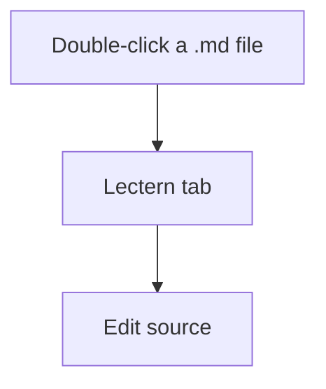
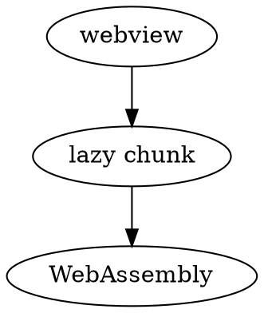

# Lectern spike

```mermaid
graph TD
  Open[Double-click a .md file] --> Reader[Lectern tab]
  Reader --> Source[Edit source]
```

```dot
digraph spike {
    "webview" -> "lazy chunk";
    "lazy chunk" -> "WebAssembly";
}
```
